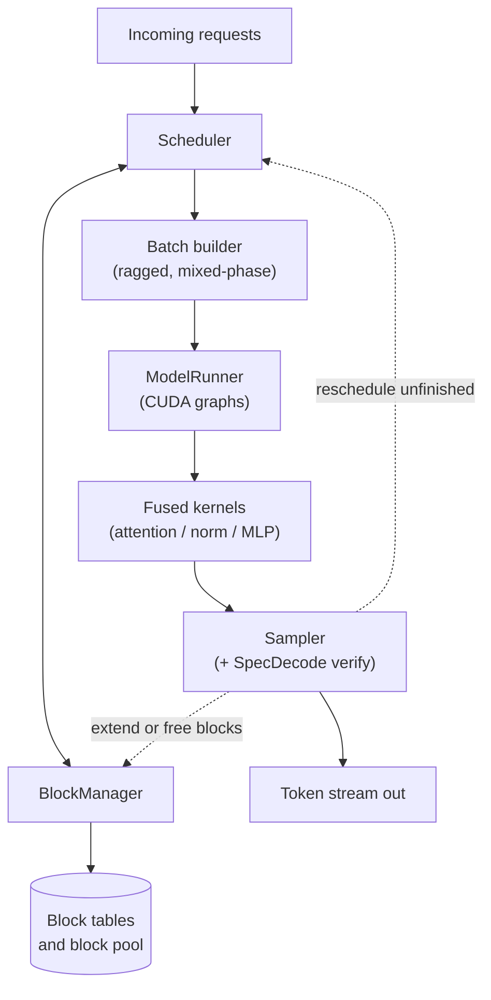
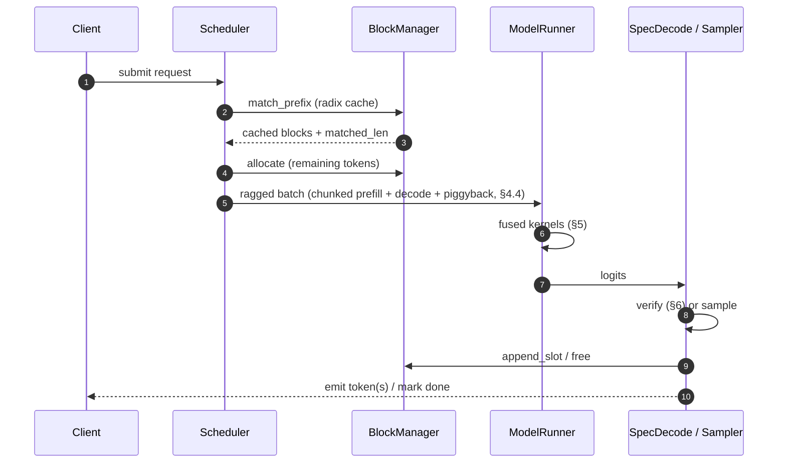

<div align="center">

# Nano-vLLM

**A PagedAttention LLM inference engine**

`Python` · `PyTorch` · `CUDA`

Single-node, multi-GPU-capable serving engine implementing paged KV cache management,<br/>
continuous batching, fused attention/norm/MLP kernels, and speculative decoding.

</div>

---

## Contents

| § | Section | Summary |
|---|---|---|
| [1](#1-goals--non-goals) | Goals / Non-Goals | What v1 does and deliberately does not do |
| [2](#2-system-architecture) | System Architecture | Components and request lifecycle |
| [3](#3-paged-kv-cache) | Paged KV Cache | Block pool, block tables, COW, radix prefix cache |
| [4](#4-continuous-batching-scheduler) | Continuous Batching Scheduler | Iteration-level scheduling, preemption, chunked prefill |
| [5](#5-fused-cuda-kernels) | Fused CUDA Kernels | FlashAttention, FP8 KV, RMSNorm + SwiGLU |
| [6](#6-speculative-decoding) | Speculative Decoding | Draft/verify with distribution-preserving rejection sampling |
| [7](#7-data--control-flow-summary) | Data / Control Flow | End-to-end path through the engine |
| [8](#8-testing--validation) | Testing & Validation | Correctness strategy per subsystem |
| [9](#9-performance-targets) | Performance Targets | Metrics and acceptance thresholds |
| [10](#10-future-work) | Future Work | Post-v1 directions |

---

## 1. Goals / Non-Goals

### Goals

| Goal | Mechanism |
|---|---|
| Near-vLLM throughput on a single node | Paged KV cache + continuous batching |
| Near-zero internal fragmentation in KV allocation | Fixed-size block pool, no contiguous per-sequence reservation |
| Latency reduction **without** altering the output distribution | Speculative decoding with modified rejection sampling |
| Kernel-level efficiency | Fused attention, fused norm + activation, FP8 KV cache |

### Non-Goals

- **Multi-node tensor/pipeline parallelism.** Out of scope for v1; interfaces are left extensible.
- **Weight quantization.** Only the KV cache is quantized (to FP8).
- **General-purpose serving frontend.** No HTTP/gRPC layer — the engine exposes a Python API.

---

## 2. System Architecture



**Request lifecycle**

```
enqueue → schedule → allocate blocks → forward pass → sample / verify
        → free or extend blocks → repeat until EOS or max_len
```

---

## 3. Paged KV Cache

### 3.1 Physical layout

The KV cache is a single pre-allocated tensor pool partitioned into fixed-size **blocks**:

```text
K_cache: [num_blocks, block_size, num_kv_heads, head_dim]
V_cache: [num_blocks, block_size, num_kv_heads, head_dim]
```

| Parameter | Value | Rationale |
|---|---|---|
| `block_size` | 16 tokens (tunable) | Balances internal fragmentation against block-table overhead |
| Allocation | Free list, non-contiguous | Removes the need for per-sequence contiguous reservation |

### 3.2 Block table indirection

Each sequence owns a **block table**: a list of physical block indices mapping logical token
position to physical storage.

```text
Sequence S (logical)  │ t0 t1 t2 ... t15 │ t16 t17 ...      │
                      │     block 0      │     block 1      │
Block table[S]        │       7          │       42         │  ← physical block ids

logical position p ──▶ physical block = block_table[p // block_size]
                       offset         = p %  block_size
```

Attention kernels gather K/V through the block table at launch time (passed as an `int32`
tensor), with no host-side copy or reshape. This is precisely what buys non-contiguous
physical storage while preserving contiguous logical semantics.

### 3.3 Copy-on-write block sharing

> Used for parallel sampling (beam / n-best) and shared prefixes.

Blocks are refcounted. Forking a sequence increments refcounts on shared blocks rather than
copying them. On a write to a block with `refcount > 1`:

1. Allocate a new physical block.
2. Copy the shared block's contents.
3. Decrement the old refcount and repoint the forking sequence's block-table entry.

Only the **last partial block** is ever copied — earlier blocks in a shared prefix stay fully
shared and effectively read-only for the sequence's lifetime.

```text
Before fork      seq A: [b0, b1, b2*]                          refcount(b2) = 1
Fork → seq B     seq A: [b0, b1, b2*]   seq B: [b0, b1, b2*]   refcount(b2) = 2
B appends        seq A: [b0, b1, b2*]   seq B: [b0, b1, b3 ]   refcount(b2) = 1
                                                    └─ COW copy of b2
```

### 3.4 Radix-tree prefix caching

**Goal:** reuse KV blocks across *unrelated* requests that share a prompt prefix — system
prompts, few-shot templates, shared document context.

A global radix tree is keyed by token sequences; edges are labeled with token spans and nodes
store the physical block id covering that span.

On each new request:

1. Walk the tree, matching the incoming prompt at **block granularity** — a prefix only counts
   as cached at a `block_size` boundary.
2. Refcount and reuse the longest matching prefix's blocks under COW semantics ([§3.3](#33-copy-on-write-block-sharing)).
3. Compute the remaining prompt suffix normally and insert it into the tree.

```text
root
└── "You are a helpful..."                 (blk 3)
    ├── "...assistant. Answer concisely."  (blk 7)  ← req A, req C
    └── "...assistant. Answer in detail."  (blk 9)  ← req B
```

**Eviction.** LRU over tree leaves. A node becomes evictable only once its block's refcount
reaches zero (no live sequence references it). Eviction then walks upward, merging internal
nodes that have become childless.

### 3.5 Block manager API

```python
class BlockManager:
    def allocate(self, seq_id, num_tokens) -> BlockTable: ...
    def can_allocate(self, num_tokens) -> bool: ...            # scheduler admission control
    def append_slot(self, seq_id) -> PhysicalBlockId: ...      # grow by one block
    def fork(self, parent_seq_id, child_seq_id) -> None: ...   # COW refcount bump
    def free(self, seq_id) -> None: ...
    def match_prefix(self, token_ids) -> tuple[BlockTable, int]: ...  # radix lookup
```

---

## 4. Continuous Batching Scheduler

### 4.1 Iteration-level scheduling

Unlike static (request-level) batching, the batch is re-formed **every decode iteration**:

```python
while True:
    running = admit_new_requests(waiting_queue, budget=token_budget)
    batch   = build_batch(running)            # mixed prefill + decode
    logits  = model_runner.forward(batch)
    tokens  = sampler.sample(logits)          # or spec-decode verify (§6)

    for seq in running:
        if seq.is_done():
            free(seq)
            emit(seq)
        else:
            block_manager.append_slot_if_needed(seq)
```

A finished sequence is evicted and replaced by a waiting one **within the same iteration
boundary**, so there is no head-of-line blocking behind the longest sequence in the batch.

### 4.2 Iteration-level preemption

When admission would exceed the free block count, the scheduler preempts the lowest-priority
running sequence (FCFS or priority-weighted) and picks a recovery strategy via cost model:

| Strategy | Action | Best when |
|---|---|---|
| **Swap** | Copy KV blocks to CPU pinned memory, free the GPU blocks | Sequence is long; PCIe transfer beats recompute |
| **Recompute** | Drop KV blocks; re-run prefill from prompt + generated tokens on resume | Sequence is short relative to swap bandwidth |

Preempted sequences re-enter the waiting queue **at the front** to avoid starvation.

### 4.3 Chunked prefill

Long prompts are split into fixed-size chunks (e.g. 512 tokens) and spread across iterations,
interleaved with other sequences' decode steps, instead of monopolizing an iteration:

```text
token_budget = 2048 per iteration

iteration i    │ prefill_chunk(seqA, 512) │ decode(seqB) │ decode(seqC) │ ...
iteration i+1  │ prefill_chunk(seqA, 512) │ decode(seqB) │ decode(seqC) │ ...
```

This bounds tail latency for decode-phase requests that would otherwise stall behind a long
prefill — the classic head-of-line problem in prefill-prioritized batching.

### 4.4 Stall-free piggyback decoding

When a prefill chunk does not fill the token budget, the scheduler piggybacks pending
single-token decode steps from other sequences into the *same* forward pass, rather than
issuing a separate near-empty kernel launch:

```text
Batch = │ prefill_chunk(seqA, 300 tok) │ decode(seqB, 1) │ decode(seqC, 1) │ ...
        └────────── one fused forward pass, ragged sequence lengths ─────────┘
```

This requires the attention kernel to handle **ragged batches** — query length varies from 1
(decode) up to the chunk size (prefill) — in a single launch. Per-sequence metadata
(`seq_lens`, `context_lens`, `block_tables`) is passed as tensors, so there is no host-side
branching per sequence.

### 4.5 Admission control

`can_allocate()` ([§3.5](#35-block-manager-api)) gates admission: a waiting request is pulled into `running` only if
the block manager can guarantee blocks for at least one more decode step. This prevents an OOM
mid-iteration.

---

## 5. Fused CUDA Kernels

### 5.1 FlashAttention (paged, ragged)

Tiled computation loops over K/V blocks fetched via the block table ([§3.2](#32-block-table-indirection)), never
materializing the full attention matrix. **Online softmax** keeps a running max `m_i` and
running sum `l_i` per tile, eliminating a separate max-reduction pass over the full sequence:

```python
for tile_j in kv_tiles:                                  # streamed via block table
    S_j   = (Q @ K_j.T) * scale
    m_new = max(m_i, rowmax(S_j))
    P_j   = exp(S_j - m_new)
    l_new = exp(m_i - m_new) * l_i + rowsum(P_j)
    O_i   = exp(m_i - m_new) * O_i + P_j @ V_j
    m_i, l_i = m_new, l_new

O_i /= l_i                                               # final rescale
```

- **Grid:** one CTA per `(sequence, query-head, query-tile)`.
- **Ragged lengths:** handled by a per-CTA loop bound read from `seq_lens[seq_id]`.
- **Paged gather:** performed inside the kernel via index arithmetic
  (`block_table[pos // block_size]`, `pos % block_size`) — not a host-side scatter/gather op.

### 5.2 FP8 KV quantization

- K/V stored as FP8 (E4M3) with a per-block scale factor (per-tensor is tunable), computed at
  write time.
- Dequantization is fused into the attention kernel's K/V load — load FP8 byte, convert,
  multiply by scale, all inline in the tile-loading step before the QKᵀ GEMM. No separate
  dequant pass.
- Halves the KV cache footprint versus FP16, which translates proportionally into more
  concurrent sequences per fixed GPU memory budget.

### 5.3 Fused RMSNorm + SwiGLU

| Fusion | What it collapses | Why |
|---|---|---|
| **RMSNorm** | Mean-square reduction + normalize + scale → one kernel | Avoids writing the intermediate normalized tensor to global memory twice |
| **SwiGLU MLP** | `SiLU(xW1) * (xW3)` gate → one kernel after the two GEMMs | Avoids a separate elementwise pass over the intermediate activation |

Both use vectorized loads (`float4` / `half2`) and warp-level reductions for the norm statistic.

---

## 6. Speculative Decoding

### 6.1 Mechanism

A small draft model proposes `k` tokens autoregressively (cheap and sequential). The target
model then verifies all `k` proposals **in a single forward pass** — verification is just
scoring, so there is no sequential dependency until acceptance is resolved.

```text
draft    d1 → d2 → d3 → d4                        k = 4, sequential, cheap
target   forward([prefix, d1, d2, d3, d4])        logits for positions 1..4 in ONE pass
verify   rejection-sample each position against the target distribution
```

### 6.2 Rejection sampling (distribution-preserving)

For each proposed token `d_i` with draft probability `q(d_i)` and target probability `p(d_i)`:

```text
accept d_i with probability  min(1, p(d_i) / q(d_i))

if rejected:
    sample a replacement from  normalize(max(0, p - q))
    stop — discard remaining proposals d_{i+1..k}

if all k accepted:
    sample one bonus token from p(·) at position k+1     (a free extra token)
```

> This is the standard Leviathan/Chen-style modified rejection sampling. It guarantees the
> accepted sequence is distributed **exactly** as if sampled from the target model alone,
> independent of draft quality — draft quality affects *speed*, never *correctness*.

### 6.3 Scheduler integration

- Draft + verify is treated as a single scheduling unit. KV cache for the draft's speculative
  tokens is allocated eagerly and truncated on rejection: the block manager rolls the block
  table length back to the accepted position, which is pure metadata with no data movement.
- `k` is tunable per request, or adapted online from the rolling acceptance rate — raise `k`
  when acceptance is high, shrink it when acceptance drops to cut wasted verification compute.

---

## 7. Data / Control Flow Summary



---

## 8. Testing & Validation

| Area | Test | Pass criterion |
|---|---|---|
| **Paging correctness** | Paged attention vs. reference unpaged (contiguous KV) implementation on identical inputs | Match within FP16/FP8 numerical tolerance |
| **COW correctness** | Fork a sequence, mutate one branch | Other branch's tokens/logits unaffected; refcounts return to 0 after both are freed |
| **Radix cache correctness** | Two requests sharing a prefix vs. run independently | Identical logits for the shared portion — no cross-contamination via cache reuse |
| **Spec-decode distribution** | KS test on token frequency over many trials | Output distribution matches target-only sampling |
| **Scheduler stress** | Adversarial mix of very long and very short sequences | Chunked prefill bounds decode tail latency vs. a naive prefill-prioritized baseline |

---

## 9. Performance Targets

| Metric | Target |
|---|---|
| Throughput (tok/s, batched) | Parity with reference vLLM on the same GPU and model |
| KV cache fragmentation | Near-zero — paging eliminates internal fragmentation by construction |
| P99 decode latency under mixed load | Bounded by chunked prefill; no unbounded head-of-line stall |
| Speculative decoding speedup | ≥ 1.5–2× wall-clock decode-step reduction at acceptance rate ≥ 0.6–0.7 |
| KV memory footprint | ~2× reduction via FP8 versus the FP16 baseline |

---

## 10. Future Work

- **Tensor parallelism** — shard the block manager and attention kernels across multiple GPUs.
- **Adaptive block size** — select per model from `head_dim` / `num_heads` to minimize
  block-table overhead.
- **Tree speculative decoding** — verify multiple draft branches simultaneously rather than a
  single linear chain.
- **Disaggregated prefill/decode** — run the two phases on separate GPU pools.
