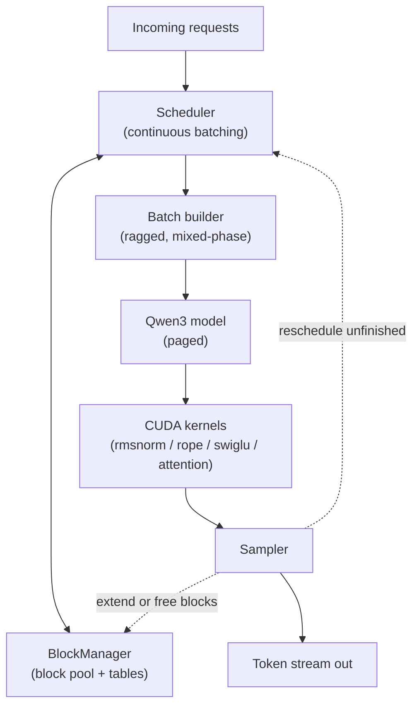
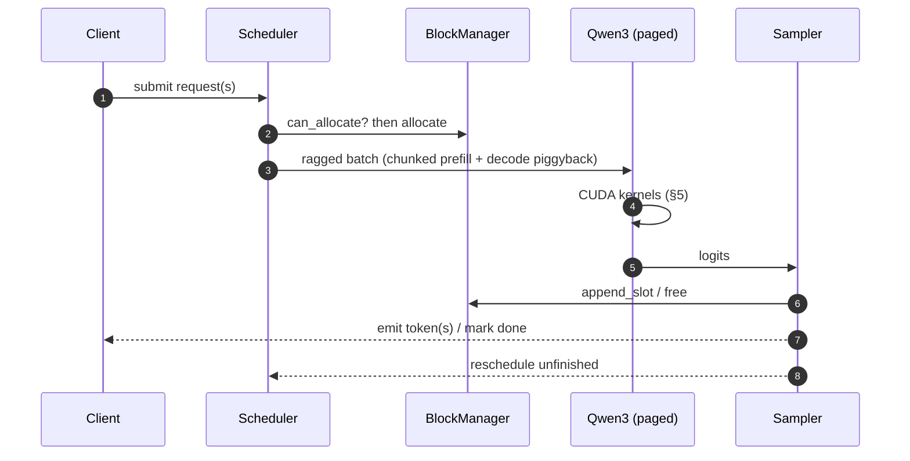

<div align="center">

# Mini-vLLM

**A paged-attention LLM inference engine, built bottom-up**

`Python` · `PyTorch` · `CUDA C++`

A single-GPU serving engine for Qwen3-0.6B: a readable reference model first,<br/>
then hand-written CUDA kernels, then a paged KV cache and a continuous-batching scheduler.

</div>

---

## Contents

| § | Section | Summary |
|---|---|---|
| [1](#1-goals--non-goals) | Goals / Non-Goals | What this engine does and deliberately does not do |
| [2](#2-notation) | Notation | The shape-symbol contract used everywhere |
| [3](#3-the-qwen3-model) | The Qwen3 Model | Architecture we reconstruct in Phase 1 |
| [4](#4-system-architecture) | System Architecture | Components and the request lifecycle |
| [5](#5-cuda-kernels) | CUDA Kernels | Online softmax, tiling, occupancy |
| [6](#6-paged-kv-cache) | Paged KV Cache | Block pool, block tables, page-walking attention |
| [7](#7-continuous-batching-scheduler) | Continuous Batching Scheduler | Iteration-level scheduling, chunked prefill, piggybacking |
| [8](#8-data--control-flow) | Data / Control Flow | End-to-end path through the engine |
| [9](#9-testing--validation) | Testing & Validation | The differential-testing strategy |
| [10](#10-performance-targets) | Performance Targets | Metrics and acceptance thresholds |
| [11](#11-future-work) | Future Work | Deliberately deferred features |

---

## 1. Goals / Non-Goals

### Goals

| Goal | Mechanism |
|---|---|
| Understand every layer of an inference engine by building it | Bottom-up: model → kernels → cache → scheduler |
| A correct, readable reference at every step | A slow PyTorch path is kept as the oracle for each fast path |
| Real GPU efficiency, written by hand | Hand-written CUDA C++ kernels for norm, activation, and attention |
| Near-zero KV fragmentation and high batch occupancy | Paged KV cache + continuous batching |

### Non-Goals

These are cut on purpose to keep the course the size of [tiny-llm](https://github.com/skyzh/tiny-llm). Each is a
reasonable follow-up once the main line works; none is on the critical path to a working engine.

- **Radix-tree prefix caching.** Cross-request prefix reuse. Paging and COW are enough to demonstrate the block
  abstraction; the radix tree is bookkeeping, not a new idea.
- **FP8 KV quantization.** A memory win, not a correctness or architecture concept.
- **CUDA graph capture.** A launch-overhead optimization layered on an already-correct decode path.
- **Preemption by swap, speculative decoding, MoE, weight quantization.** Each is a self-contained extension.
- **Multi-GPU, and any HTTP/gRPC frontend.** The engine exposes a Python API only.

---

## 2. Notation

One symbol table, used in every design section and every plan step. Shapes are written most-significant dimension
first, matching PyTorch's row-major layout.

| Symbol | Meaning |
|---|---|
| `B` | Batch size (number of sequences in a forward pass) |
| `L` | Query length — number of *new* tokens fed this step (`L = 1` in decode, `L > 1` in prefill) |
| `S` | Key/value source length — total tokens attended to, including the cache |
| `E` | Hidden size (`hidden_size`, the per-token embedding width) |
| `H_q` | Number of query heads |
| `H_k` | Number of key/value heads (`H_k ≤ H_q` under GQA; `H_q % H_k == 0`) |
| `D` | Head dimension (`head_dim`) |
| `V` | Vocabulary size |
| `P` | Page size — tokens per KV block (a power of two, default 16) |
| `N..` | Zero or more leading batch dimensions |

The GQA group size is `G = H_q / H_k`: each KV head is shared by `G` query heads.

---

## 3. The Qwen3 Model

Mini-vLLM builds **Qwen3-0.6B**, the same model as tiny-llm, so its book chapters can be read alongside this code.
Qwen3-0.6B is a decoder-only transformer with these dimensions:

| Field | Value |
|---|---|
| `num_hidden_layers` | 28 |
| `hidden_size` (`E`) | 1024 |
| `num_attention_heads` (`H_q`) | 16 |
| `num_key_value_heads` (`H_k`) | 8 |
| `head_dim` (`D`) | 128 |
| `intermediate_size` | 3072 |
| `vocab_size` (`V`) | 151936 |
| `rms_norm_eps` | 1e-6 |
| `rope_theta` | 1,000,000 |
| `tie_word_embeddings` | true |

Note `H_q · D = 16 · 128 = 2048 ≠ E = 1024`: the attention projection is *wider* than the hidden size, so `wq`
maps `E → H_q·D` and `wo` maps `H_q·D → E`.

**Per layer** (pre-norm residual):

```text
h  = x + Attention(RMSNorm(x))
out = h + SwiGLU_MLP(RMSNorm(h))
```

**Attention block**, including the two features that distinguish Qwen3 from Qwen2.5:

```text
q = wq · x                              -> B, L, H_q, D
k = wk · x                              -> B, L, H_k, D
v = wv · x                              -> B, L, H_k, D
q = RMSNorm(q, q_norm)                  # QK-norm: RMSNorm over the head_dim of q ...
k = RMSNorm(k, k_norm)                  # ... and of k, before RoPE
q = RoPE(q, positions)                  # rotary embedding takes explicit positions
k = RoPE(k, positions)
attn = softmax(q·kᵀ / sqrt(D) + causal_mask) · v   # GQA: each KV head serves G query heads
out = wo · attn                         -> B, L, E
```

- **QK-norm.** An RMSNorm applied to each query and key head vector (over `D`) before RoPE. Qwen2.5 lacks it;
  omitting it silently corrupts Qwen3 outputs.
- **GQA.** `H_k < H_q`, so KV heads are repeated `G` times to match the query heads (or, in the fast kernels,
  indexed with `q_head // G`). With Qwen3-0.6B, `G = 2`, so the `H_k` dimension is exercised for real.

**SwiGLU MLP**: `down( silu(gate(x)) * up(x) )`, where `gate` and `up` map `E → intermediate`, `down` maps back.

The LM head is tied to the embedding matrix (`tie_word_embeddings=true`): logits are `embedding_weightᵀ · h`.

Weights are stored and computed in **BF16**; numerically sensitive reductions (RMSNorm mean-square, softmax,
online-softmax state) accumulate in **FP32**.

---

## 4. System Architecture

The engine is assembled in dependency order, and each layer is usable on its own before the next is added.



**Request lifecycle**

```text
enqueue → schedule → allocate blocks → forward pass → sample
        → free or extend blocks → repeat until EOS or max_len
```

The build order deliberately runs *opposite* to the data-flow arrows: we build the model and kernels first (so we
can generate text and measure it), and only then wrap them in the cache and scheduler that a production engine puts
in front.

---

## 5. CUDA Kernels

Every kernel replaces a slow PyTorch expression that already passed its test, and is checked against it. The point
is not to beat cuBLAS; it is to write the tiling, the reductions, and the online softmax by hand and understand why
they are shaped the way they are.

### 5.1 Elementwise and reduction kernels

| Kernel | Collapses | Why it helps |
|---|---|---|
| **RMSNorm** | mean-square reduction + normalize + scale → one kernel | Avoids two extra global-memory round trips over the activation |
| **RoPE** | position table gather + rotate-pairs → one kernel | Fuses the rotation into a single pass over `q` and `k` |
| **SwiGLU** | `silu(gate) * up` → one kernel after the two GEMMs | Avoids a separate elementwise pass over the intermediate |

The design pattern for all three: **one CUDA block per row** (one token, or one head vector), vectorized loads
(`float4` / `__half2`), and warp-level reductions (`__shfl_down_sync`) for any statistic. Because these ops are
memory-bound, the score to report is achieved bandwidth versus the card's peak, not raw wall-clock.

### 5.2 Attention: online softmax

Attention never materializes the full `S`-wide score row. It streams over K/V tiles, keeping a running max `m`,
running denominator `l`, and accumulator `O`, rescaling on each tile — the FlashAttention recurrence:

```python
for tile_j in kv_tiles:                 # streamed
    S_j   = (Q @ K_j.T) * scale         # + causal mask inside the diagonal tile
    m_new = max(m, rowmax(S_j))
    P_j   = exp(S_j - m_new)
    l     = exp(m - m_new) * l + rowsum(P_j)
    O     = exp(m - m_new) * O + P_j @ V_j     # O rescaled by the SAME factor as l
    m     = m_new
O /= l                                  # final normalize
```

The single most important idea in the course is that `O` is rescaled by `exp(m_old - m_new)` — the *same* factor as
`l` — because the previously accumulated `P·V` terms were computed against the old maximum. Getting this wrong
produces plausible-but-wrong text, the hardest kind of bug to catch.

Two attention shapes, both implemented twice (dense first, then paged):

| Kernel | Query length | Grid | Extra concern |
|---|---|---|---|
| **Decode** | `L = 1` | one block per `(sequence, kv_head)` | Pure reduction over `S`; no query tiling |
| **Prefill** | `L > 1` | one block per `(sequence, head, query-tile)` | Causal mask *within* the diagonal tile; skip tiles above the diagonal |

Prefill tiles over queries as well as keys and uses shared memory to stage each K/V tile. Skipping key tiles
strictly above the diagonal is both a real speedup and a classic source of off-by-one bugs.

### 5.3 Occupancy and correctness notes

- **FP32 accumulation.** `m`, `l`, `O`, and the RMSNorm mean-square accumulate in FP32 even though storage is BF16.
- **Shared-memory budget.** Prefill tile sizes are bounded by shared memory per SM (`sm_120`: 100 KB opt-in). The
  tile size is a tunable, not a constant baked into the algorithm.
- **`__syncthreads()` discipline.** Every shared-memory tile load is followed by a barrier before the tile is read.
- **Correctness before speed.** The first version of the prefill kernel uses scalar FMA inner loops. A tensor-core
  (`mma`) inner loop is an *optional* later upgrade behind the same correctness test.

---

## 6. Paged KV Cache

Introduced in Phase 4, only after continuous batching has shown why a growing dense cache does not scale.

### 6.1 Physical layout

One pre-allocated pool per layer, partitioned into fixed-size **pages** (blocks) of `P` tokens:

```text
K_cache: [num_blocks, P, H_k, D]
V_cache: [num_blocks, P, H_k, D]
```

Allocation is a free list, so pages are non-contiguous — this is what removes per-sequence contiguous reservation
and the fragmentation it causes.

### 6.2 Block table indirection

Each sequence owns a **block table** mapping logical position to physical page:

```text
logical position p ──▶ physical block = block_table[p // P]
                       offset         = p %  P
```

The attention kernel performs this gather *inside* the kernel via index arithmetic on an `int32` `block_table`
tensor — there is no host-side scatter/gather and no reshape. This is what buys non-contiguous physical storage
while preserving contiguous logical semantics.

### 6.3 Copy-on-write sharing

Pages are refcounted. Forking a sequence increments refcounts rather than copying. On a write to a page with
`refcount > 1`, allocate a fresh page, copy, decref the old, and repoint the block-table entry. Only the last
partial page is ever copied; earlier pages of a shared prefix stay shared.

### 6.4 Block manager API

```python
class BlockManager:
    def can_allocate(self, num_tokens) -> bool: ...   # scheduler admission control
    def allocate(self, seq) -> None: ...              # reserve pages for a new sequence
    def append_slot(self, seq) -> None: ...           # grow by one token, add a page if needed
    def fork(self, parent, child) -> None: ...         # COW refcount bump, zero copies
    def free(self, seq) -> None: ...
```

---

## 7. Continuous Batching Scheduler

Design goal: a scheduling decision may change *timing*, never *output*. Every scheduler test asserts token-identical
output against the single-sequence path.

### 7.1 Iteration-level scheduling

The batch is re-formed **every decode iteration**, not held fixed for a request's lifetime:

```python
while work_remains:
    running = admit_new_requests(waiting, budget=token_budget)   # gated by can_allocate
    batch   = build_batch(running)                               # mixed prefill + decode
    logits  = model.forward(batch)
    tokens  = sampler.sample(logits)
    for seq in running:
        if seq.is_done(): free(seq); emit(seq)
        else:             block_manager.append_slot(seq)
```

A finished sequence is replaced by a waiting one within the same iteration boundary, so there is no head-of-line
blocking behind the longest sequence in the batch.

### 7.2 Chunked prefill

Long prompts are split into fixed-size chunks and spread across iterations, tracked by a `num_computed_tokens`
counter on the sequence, so a 2000-token prefill cannot monopolize an iteration:

```text
token_budget = 2048 per iteration
iter i    │ prefill_chunk(A, 512) │ decode(B) │ decode(C) │ ...
iter i+1  │ prefill_chunk(A, 512) │ decode(B) │ decode(C) │ ...
```

This bounds tail latency for decode-phase requests that would otherwise stall behind a long prefill.

### 7.3 Stall-free piggyback decoding

When a prefill chunk does not fill the token budget, pending single-token decodes are piggybacked into the *same*
forward pass:

```text
Batch = │ prefill_chunk(A, 300) │ decode(B, 1) │ decode(C, 1) │ ...
        └────── one ragged forward pass, query length varies per sequence ──────┘
```

This is why the attention kernel must accept **ragged batches**: query length varies from 1 (decode) to the chunk
size (prefill) within one launch, with per-sequence loop bounds read from `seq_lens` / `context_lens` tensors and no
host-side per-sequence branching.

### 7.4 Admission control

`can_allocate()` gates admission: a waiting request enters `running` only if the manager can guarantee pages for at
least one more decode step, which prevents an OOM mid-iteration.

---

## 8. Data / Control Flow



---

## 9. Testing & Validation

The central difficulty: a wrong answer still looks like fluent text. Correctness cannot be eyeballed. So every fast
component is checked against a slow, obvious one that already passed — **differential testing**.


| Area | Test | Pass criterion |
|---|---|---|
| Model correctness | Full forward vs. HF `transformers` | Logits within FP16 tolerance **and** greedy tokens match exactly for 32 steps |
| Each CUDA kernel | Kernel vs. the PyTorch expression it replaces | Match within tolerance; greedy tokens unchanged end to end |
| Paging correctness | Paged attention vs. dense-gather reference, with a **shuffled** block table | Identical output — the shuffle proves the indirection |
| COW correctness | Fork, mutate one branch | Other branch unchanged; refcounts return to 0 after both freed |
| Scheduler | Chunked / piggybacked / preempted runs vs. single-sequence | **Token-identical** output; a leak check confirms no pages leak |

Two levers make this sharp:

- **Greedy decoding** (`temperature=0`) forces two correct implementations to produce *token-identical* output — a
  far stronger signal than comparing float tensors.
- **A leak-check fixture** asserts the block pool is fully free at teardown, catching refcount bugs at the moment
  they are introduced.

### Numerical tolerances

| Comparison | rtol / atol | Note |
|---|---|---|
| Single op, FP32 | `1e-5` | Near-exact |
| Single op, BF16 | `1e-2` | Reductions in different orders |
| Full-model logits, BF16 | `2e-2` | Error accumulates across 28 layers |
| Greedy token IDs | **exact** | The strongest check — prefer it |

---

## 10. Performance Targets

| Metric | Target |
|---|---|
| Model correctness | Greedy output token-identical to HF `transformers` |
| Kernel bandwidth (RMSNorm/RoPE/SwiGLU) | A reported fraction of the card's peak memory bandwidth |
| Attention throughput | Within a stated factor of PyTorch SDPA on the same shapes |
| Batched throughput (tok/s) | Large win over HF `generate` at batch sizes > 1 — the paging + continuous-batching payoff |
| KV fragmentation | Near-zero by construction |
| P99 decode latency under mixed load | Bounded by chunked prefill; no unbounded head-of-line stall |

Hardware of record: RTX 5070 Laptop, 8 GB, Blackwell `sm_120`.

---

## 11. Future Work

The [Non-Goals](#1-goals--non-goals) are the natural extensions, each with a ready-made correctness test once the
main line is green: radix-tree prefix caching, FP8 KV quantization, CUDA graph capture, preemption by swap,
speculative decoding, tensor/pipeline parallelism, and a network serving frontend.
