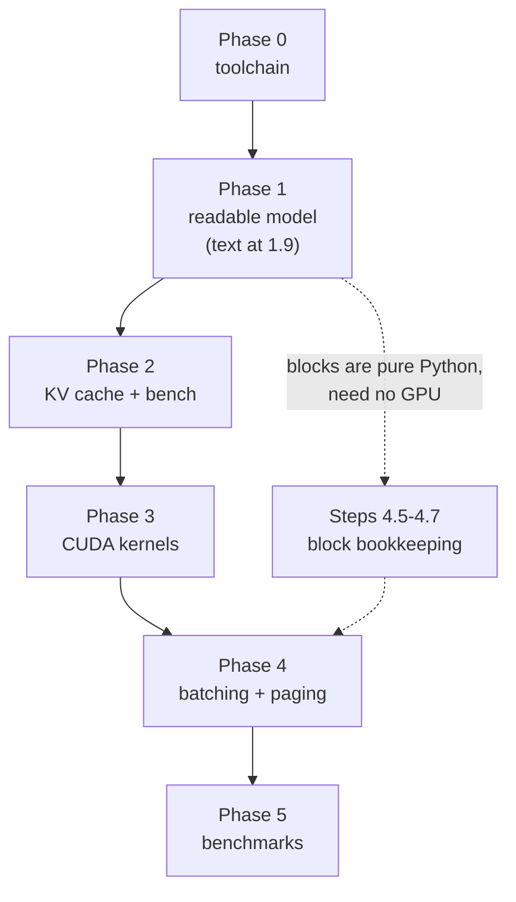

<div align="center">

# Build Plan

**Implementation roadmap for [`DESIGN.md`](./DESIGN.md)**

33 steps · one source file and one test file per step · build bottom-up like [tiny-llm](https://github.com/skyzh/tiny-llm)

</div>

---

## Contents

| Phase | Focus | Steps | GPU needed | Design ref |
|---|---|---|---|---|
| [0](#phase-0--toolchain) | Toolchain | 0.1–0.2 | yes (smoke) | — |
| [1](#phase-1--from-matmul-to-text) | From matmul to text | 1.1–1.10 | yes | [§3](./DESIGN.md#3-the-qwen3-model) |
| [2](#phase-2--kv-cache-and-the-decode-loop) | KV cache & decode loop | 2.1–2.3 | yes | [§3](./DESIGN.md#3-the-qwen3-model) |
| [3](#phase-3--cuda-kernels) | CUDA kernels | 3.1–3.6 | yes | [§5](./DESIGN.md#5-cuda-kernels) |
| [4](#phase-4--serving) | Serving (batching + paging) | 4.1–4.9 | yes | [§6](./DESIGN.md#6-paged-kv-cache), [§7](./DESIGN.md#7-continuous-batching-scheduler) |
| [5](#phase-5--validation) | Validation & benchmarks | 5.1–5.3 | yes | [§9](./DESIGN.md#9-testing--validation), [§10](./DESIGN.md#10-performance-targets) |

Supporting material: [How to use this plan](#how-to-use-this-plan) · [The oracle strategy](#the-oracle-strategy) ·
[Environment](#environment) · [Repo layout](#repo-layout) · [Notation](#notation) · [Test conventions](#test-conventions) ·
[Tolerances](#numerical-tolerances) · [Dependency graph](#dependency-graph)

---

## How to use this plan

The design is inverted from a production engine on purpose. A real server puts the scheduler and cache in front of
the model; we build them in the opposite order — **model first, so you generate real text early and can measure it,
then kernels, then the serving layer that wraps them.** You are talking to a working model at Step 1.9, not two
thirds of the way in.

Every step is the same loop. Do them in order; each is small enough to finish in a sitting and leaves the repo green.

```
1. READ    the DESIGN.md section the step cites — before writing any code
2. PREDICT write down what you expect the test to show (a shape, a number, a token)
3. WRITE   the one source file
4. TEST    the one test file, run it, and reconcile it against your prediction
5. COMMIT  only when the step's "Done when" criteria all hold
```

Step 2 is the part people skip and the part that produces the learning. If your prediction and the test disagree,
you have found either a bug or a gap in your mental model, and it is worth stopping to work out which.

**Rules that keep the plan honest**

- **One source file per step.** If a step seems to need two, the step is wrong — split it. (`(extend)` marks a step
  that adds to a file an earlier step created.)
- **Never delete a working slower path.** The readable PyTorch implementations become the oracles for the CUDA and
  paged versions. This is the backbone of the whole plan.
- **The test suite only grows.** A step is not done if it broke an earlier test.
- **Benchmark only after correct.** Every optimization compares against the correct version it replaces, so you
  always know both the speedup and that it is still right.

---

## The oracle strategy

The central difficulty in an inference engine is that a wrong answer still looks like fluent text. You cannot
eyeball correctness. So the plan is built around **differential testing**: every fast, clever component is checked
against a slow, obvious one that already passed.


Each arrow is a test. The chain means a Phase 4 bug can be bisected by walking backwards until a layer agrees with
its oracle again, which localizes the fault to one hop.

Two consequences worth internalizing:

- **The readable model is never thrown away.** Phase 2 forks it rather than mutating it; Phase 3 keeps the PyTorch
  op beside each kernel. Every fast path has a slow twin to diff against.
- **Greedy decoding is your friend.** With `temperature=0`, two correct implementations must produce
  *token-identical* output — a far sharper signal than comparing float tensors. Sampling paths get statistical tests.

---

## Environment

Detected on this machine:

| Component | Version / spec | Consequence for the plan |
|---|---|---|
| GPU | RTX 5070 Laptop, **8 GB**, Blackwell `sm_120` | 8 GB is the binding constraint; Qwen3-0.6B leaves ample room for KV |
| PyTorch | 2.11.0 **+cu130** | Ships CUDA 13.0 runtime; BF16 native |
| System `nvcc` | **12.8** at `/usr/local/cuda-12.8` | **Major-version mismatch with torch's cu130 — Step 0.1 must resolve this** |
| Triton | 3.6.0 | Present but unused — kernels here are raw CUDA C++, not Triton |
| Python | 3.13.11 | Modern typing syntax is fine (`X | None`, builtin generics) |

**The toolchain caveat, up front.** `torch.utils.cpp_extension` checks that the CUDA compiler's major version
matches the one PyTorch was built against and raises otherwise. The system `nvcc` is 12.8 while this PyTorch is
cu130, and `/usr/local/cuda-13` is a dangling symlink with no toolkit behind it. **Nothing in Phase 3 or 4 compiles
until this is fixed**, which is why proving a real kernel builds and loads is Step 0.1's entire job, before anything
depends on it.

**How it was actually resolved** (Step 0.1, now done). The system toolkit is left alone; the CUDA 13 compiler comes
from pip wheels instead, and `mini_vllm/kernels/extension.py` assembles them into a `CUDA_HOME` under `build/` that
torch accepts. Three things made this less mechanical than it sounds, each of which is now an assertion in
`tests/test_env.py`:

1. **The toolkit is scattered across site-packages trees.** nvcc and its nvvm backend land in one, the runtime
   headers and libraries in another, so no single directory looks like a CUDA install. The include and library search
   paths have to be merged, not chosen.
2. **`nvidia-cuda-cccl` is required and is not a dependency of anything.** `cuda_fp16.h` includes `<nv/target>`,
   which the nvcc wheel does not ship, so the first compile fails on a missing header.
3. **The compiler wheels must share a minor version, and pip will not do that for you.** `nvidia-cuda-nvcc` has
   loose bounds on `nvidia-nvvm` and `nvidia-cuda-crt`, so a plain install produced nvvm 13.3 driving ptxas 13.0
   (`ptxas fatal: Unsupported .version 9.3`), and mixing a 13.0 CCCL with a 13.3 nvcc trips CCCL's own
   `"CUDA compiler and CUDA toolkit headers are incompatible"` guard. All four are pinned to the 13.0 line in
   `requirements.txt`, matching torch's cu130 runtime.

The alternatives, if a future machine needs them: install a real CUDA 13 toolkit and point `CUDA_HOME` at it, or drop
to a `torch==2.x+cu128` wheel matching the system 12.8 `nvcc`.

**On raw CUDA C++ instead of Triton.** tiny-llm's kernels are Metal C++ compiled as an MLX extension; the faithful
translation is CUDA C++ compiled as a torch extension. You write the tiling, the shared-memory staging, the warp
reductions, and the online-softmax rescaling by hand — the ideas the course exists to teach — rather than letting a
DSL infer them.

**Model.** Qwen3-0.6B (`Qwen/Qwen3-0.6B`), the same model as tiny-llm so its book chapters map onto this code. FP16
weights are ~1.2 GB; on 8 GB that leaves several GB for the KV cache. See [§3](./DESIGN.md#3-the-qwen3-model) for the
exact dimensions and the two Qwen3-specific features (QK-norm, GQA).

---

## Repo layout

The end state. Create directories as their first file arrives, not up front. `mini_vllm/` is the Python package,
grouped by lifecycle stage the way [Mini-GPT](../Mini-GPT/PLAN.md#repo-layout) is; `csrc/` holds the CUDA sources
compiled into one extension.

```text
Mini-vLLM/
├── Makefile                      0.1   setup / ext / test / bench / clean
├── requirements.txt              0.1
├── pytest.ini                    0.1   pythonpath = . ; markers
├── mini_vllm/
│   ├── __init__.py               0.1, 4.9   re-exports LLM
│   ├── basics.py                 1.1
│   ├── attention.py              1.2, 1.4
│   ├── positional_encoding.py    1.3
│   ├── layer_norm.py             1.5
│   ├── embedding.py              1.6
│   ├── sampler.py                1.10
│   ├── generate.py               1.9, 2.2
│   ├── kv_cache.py               2.1
│   ├── bench.py                  2.3, 3.1, 5.1, 5.2   one harness, four modes
│   ├── model/
│   │   ├── loader.py             1.7
│   │   ├── qwen3.py              1.8   the frozen oracle
│   │   └── qwen3_cached.py       2.2
│   ├── kernels/
│   │   ├── extension.py          0.1   JIT build/load of csrc/
│   │   └── ops.py                3.1-3.6, 4.8   typed Python wrappers
│   ├── block/
│   │   ├── block_pool.py         4.5
│   │   ├── block_table.py        4.6
│   │   └── block_manager.py      4.7
│   └── serve/
│       ├── sequence.py           4.1
│       ├── batch.py              4.2
│       ├── scheduler.py          4.3, 4.4
│       └── engine.py             4.9
├── csrc/
│   ├── bindings.cpp              0.1   extended by each kernel step
│   ├── hello.cu                  0.1
│   ├── rmsnorm.cu                3.1
│   ├── rope.cu                   3.2
│   ├── swiglu.cu                 3.3
│   ├── decode_attention.cu       3.4
│   ├── flash_prefill.cu          3.5, 3.6
│   └── paged_attention.cu        4.8
└── tests/                        one test_*.py per source file
```

Three notes on why it is shaped this way.

**`model/` and `kernels/` stay separate, and never share code.** `model/qwen3.py` is frozen once
[Step 1.8](#step-18--the-full-qwen3-model) is green — it imports nothing from `kernels/` and stays pure PyTorch,
because it is the oracle every kernel is diffed against. If a kernel and its readable twin ever shared an
implementation, the differential test would be comparing a thing against itself and would prove nothing.

**`serve/` is one subsystem, not four.** The sequence state, the batch builder, the scheduler, and the engine are a
single control loop passing one `ForwardBatch` between them; splitting them across sibling top-level directories
would suggest a modularity that does not exist. `block/` is separate because it is pure integer bookkeeping with no
GPU dependency — which is exactly why [Steps 4.5–4.7](#step-45--block-pool) can be written away from the machine.

**One test file per source file, not per phase.** This diverges from Mini-GPT's phase-grouped suite on purpose:
every step here ends with a single `pytest tests/test_x.py` command that must go green before you commit, and that
loop is the spine of the plan. The cost is more files; the benefit is that a step's "Done when" is one command.

---

## Notation

The shape-symbol contract from [§2](./DESIGN.md#2-notation), repeated here because every step's shape blocks use it.
Shapes are written most-significant dimension first (PyTorch row-major).

| Symbol | Meaning |
|---|---|
| `B` | Batch size |
| `L` | Query length (new tokens this step; `1` in decode, `>1` in prefill) |
| `S` | Key/value source length (total attended tokens, cache included) |
| `E` | Hidden size (`hidden_size`) |
| `H_q` / `H_k` | Query / key-value head counts (`H_q % H_k == 0`, group size `G = H_q / H_k`) |
| `D` | Head dimension (`head_dim`) |
| `V` | Vocabulary size |
| `P` | Page size (tokens per KV block) |
| `N..` | Zero or more leading batch dimensions |

---

## Test conventions

Established once in [Step 0.2](#step-02--shared-test-infrastructure) and used by every later step.

| Marker | Meaning | Run with |
|---|---|---|
| *(none)* | Pure CPU logic, milliseconds | `pytest -m "not cuda"` |
| `@pytest.mark.cuda` | Needs CUDA (kernels, model forward) | `pytest -m cuda` |
| `@pytest.mark.oracle` | Needs the Qwen3-0.6B weights downloaded | `pytest -m oracle` |
| `@pytest.mark.slow` | Statistical or stress tests, minutes | `pytest -m slow` |

Conventions that pay off later:

- **Seed everything.** A `seeded` autouse fixture sets `torch.manual_seed` and Python's `random`, so a failure is
  always reproducible.
- **A tiny synthetic model.** A `tiny_qwen3()` fixture builds a randomly-initialized 2-layer Qwen3 with small
  dimensions, so most correctness tests run on the GPU in milliseconds without ever downloading weights. The real
  weights are reserved for `@oracle` end-to-end tests.
- **A dtype-aware `assert_allclose`.** One helper that picks the [tolerance](#numerical-tolerances) from the tensor
  dtype, so no test hardcodes a magic number.
- **A leak-check fixture** (from [Step 4.5](#step-45--block-pool) on) asserting the block pool is fully free at
  teardown — this catches refcount bugs at the moment they are introduced rather than three steps later.
- **Property tests over example tests** for the Phase 4 block data structures. Random operation sequences find the
  aliasing bugs that hand-written cases miss.

---

## Numerical tolerances

Comparing floats needs a threshold tight enough to catch bugs and loose enough to tolerate legal reassociation.
Starting points, keyed by dtype so `assert_allclose` can choose automatically:

| Comparison | Threshold | Note |
|---|---|---|
| Single op, FP32 | `1e-5` rtol/atol | Should be near-exact |
| Single op, BF16 | `1e-2` rtol/atol | Reductions in different orders |
| Full-model logits, FP32 | `1e-4` relative norm | Isolates arithmetic from rounding |
| Full-model logits, BF16 | `5e-2` relative norm | Not elementwise — see below |
| Greedy token IDs | **exact** | The strongest check available — prefer it |

**Full-model BF16 logits need a different instrument, not a looser tolerance** — measured while doing
[Step 1.8](#step-18--the-full-qwen3-model). An elementwise `atol` on a BF16 residual stream mostly reports magnitude:
BF16 keeps 8 mantissa bits, so one ULP at magnitude 512 is an absolute difference of 4, and two *correct*
implementations that disagree by a single bit look like `atol=4`. Compare `‖ours − theirs‖ / ‖theirs‖` instead. This
model sits at 1.7% against HuggingFace on real text, while the subtlest wrong model worth worrying about — Qwen2's
`rope_theta` of 10000 instead of Qwen3's 1e6 — sits at 14%, so a 5% ceiling has roughly 3x of room on either side.
Measure it on **real text**: random token ids are chaotically amplified through 28 layers, reaching 11% while proving
nothing.

Prefer the exact checks wherever they exist, and note that FP32 gives you one. With rounding out of the way a correct
implementation agrees with HuggingFace to ~1e-6 relative and *every* argmax matches, which is a far stronger statement
than any BF16 tolerance. So when a comparison looks marginal, rerun it in FP32: an error that survives is real, and
one that vanishes was rounding all along.

**Changing a tensor's shape changes its arithmetic** — measured while doing [Step 2.2](#step-22--cached-model-and-serving-loop),
and the reason that step's exact check has to run in FP32. A decode step multiplies a `1 x D` query by the cache; a full
recompute multiplies `S x D`. Same numbers, same operation, but cuBLAS picks a different kernel for a matrix-vector
product than for a matrix-matrix one, and a different kernel sums in a different order. The two disagree by 2% relative
in BF16 — while the *prefill* path, which keeps the original shapes, comes out **bitwise identical**. That pairing is
the proof: shape is the only variable, so shape is the whole explanation.

This is not a caching quirk, it is the rule for every optimization that follows. A tiled kernel, a fused kernel, a
paged cache, a batched-together request — each one reassociates a sum, so each one forfeits bitwise equality in BF16
while remaining exactly correct. Plan for it now: assert token identity in **FP32**, where there is enough headroom
that reassociation does not change any argmax, and in BF16 assert *drift plus a near-tie characterization* instead.
The alternative — loosening the BF16 tolerance until it passes — trades a real check for a decoration.

When a logits comparison fails, diff **layer by layer** with a forward hook rather than staring at the final tensor.
A per-layer diff against the oracle turns a mystery into an address — and the *shape* of the curve is the diagnosis:
smoothly growing error is rounding, a jump at one layer is the bug.

---

## Phase 0 — Toolchain

Two steps, then you never think about tooling again. The whole point is to prove the CUDA extension pipeline works
*before* Phase 3 depends on it.

#### Step 0.1 — Dependencies & CUDA extension toolchain

**Write** `requirements.txt`, `Makefile`, `pytest.ini`, `csrc/hello.cu`, `csrc/bindings.cpp`,
`mini_vllm/kernels/extension.py` · **Test** `tests/test_env.py`

- Pin `torch`, `transformers`, `safetensors`, `numpy`, `pytest`, `hypothesis` (property tests in Phase 4),
  `huggingface-hub`. Record the CUDA-wheel index URL as a comment.
- `pytest.ini` holds pytest config only: register the four markers from
  [Test conventions](#test-conventions), set `testpaths = tests` and `pythonpath = .` so `import mini_vllm` works
  with no install step.
- `Makefile` is the entry point for every later phase, matching the other Mini projects: `setup` (venv + pinned
  deps), `ext` (force a rebuild of the CUDA extension), `test` (`python -m pytest -q`), `bench`
  (`python -m mini_vllm.bench`), `clean`, and a default `help`. `ext` exists because a stale JIT cache is the first
  thing to suspect when a kernel change appears to do nothing.
- `csrc/hello.cu`: a trivial `y = a*x + b` (axpby) CUDA kernel over a 1-D tensor — the direct analog of tiny-llm's
  `axpby` first extension. `csrc/bindings.cpp` exposes it with `PYBIND11_MODULE(TORCH_EXTENSION_NAME, m)`.
- `mini_vllm/kernels/extension.py`: a `load_extension()` helper that JIT-compiles all of `csrc/` via
  `torch.utils.cpp_extension.load(..., extra_cuda_cflags=["-arch=sm_120"])` and caches the module. Resolve `csrc/`
  relative to the repo root (`Path(__file__).resolve().parents[2]`), never the working directory. This is where the
  version-mismatch fix from [Environment](#environment) lands (setting `CUDA_HOME` / `os.environ` before the call).

**Done when:** the extension actually compiles and loads, and `hello` matches `a*x + b` from PyTorch on a GPU tensor:

```bash
make test                       # or: pytest tests/test_env.py -v
```

`test_env.py` asserts CUDA is available, compute capability is `(12, 0)`, `torch.__version__` matches
`requirements.txt`, the extension builds without a version-check error, and `pytest` collects with no marker warnings.

> **Learn:** if this step is painful, that pain is the toolchain telling you something true. Better to hear it now,
> over a five-line kernel, than in Step 3.4 while also debugging online softmax.

#### Step 0.2 — Shared test infrastructure

**Write** `tests/conftest.py` · **Test** *(itself)* `tests/test_infra.py`

- The `seeded` autouse fixture (`torch.manual_seed`, `random.seed`) and a `device` fixture that skips `@cuda` tests
  when CUDA is absent.
- `assert_allclose(actual, expected)` that reads the dtype and applies the matching
  [tolerance](#numerical-tolerances), plus a greedy-token equality helper.
- A `tiny_qwen3()` fixture: a randomly-initialized Qwen3 with `num_layers=2`, `E=64`, `H_q=4`, `H_k=2`, `D=32`,
  small vocab — same architecture as the real model ([§3](./DESIGN.md#3-the-qwen3-model)), tiny enough to run every
  correctness test on the GPU in milliseconds. Built from HuggingFace's `Qwen3ForCausalLM`, because ours does not
  exist until [Step 1.8](#step-18--the-full-qwen3-model) — which is the right way round, since from 1.8 on this
  fixture *is* the oracle and needs no download. Keep `H_q · D ≠ E` and `G = 2`: those two properties are what make
  the fixture catch the reshape and GQA-indexing bugs it exists to catch.

**Done when:** `assert_allclose` passes on equal tensors and fails just outside tolerance; `tiny_qwen3()` constructs
and does one forward pass without error:

```bash
pytest tests/test_infra.py -v
```

---

## Phase 1 — From matmul to text

The heart of the course. You build the Qwen3 model bottom-up in readable PyTorch, and at
[Step 1.9](#step-19--the-generation-loop) it produces real text. The oracle throughout is `torch`'s own operators
and HuggingFace `transformers`. No custom kernels yet, no cache yet — just get the math right.

Design reference: [§3](./DESIGN.md#3-the-qwen3-model).

#### Step 1.1 — Basics: linear, SiLU, softmax

**Write** `mini_vllm/basics.py` · **Test** `tests/test_basics.py`

**📚 Readings**

- [The Illustrated Transformer](https://jalammar.github.io/illustrated-transformer/)

- `linear(x, w, bias=None)`: `x` is `N.. x I`, `w` is `O x I`, bias is `O`, output `N.. x O`. Matches
  `torch.nn.functional.linear` (weight stored transposed, the HF convention).
- `silu(x) = x * sigmoid(x)`.
- `softmax(x, dim)`: implement it by hand with the max-subtraction trick, in FP32 even for a BF16 input, then cast
  back. This is the readable version [Step 3.4](#step-34--decode-attention-online-softmax) will replace with online
  softmax.

**Done when:** each matches its `torch` builtin (`F.linear`, `F.silu`, `F.softmax`) to FP32 tolerance, including a
numerically nasty input (large positive logits) where a naive softmax overflows:

```bash
pytest tests/test_basics.py -v
```

#### Step 1.2 — Attention and multi-head attention

**Write** `mini_vllm/attention.py` · **Test** `tests/test_attention.py`

**📚 Readings**

- [Attention Is All You Need](https://arxiv.org/abs/1706.03762)
- [PyTorch `scaled_dot_product_attention`](https://pytorch.org/docs/stable/generated/torch.nn.functional.scaled_dot_product_attention.html)

- `scaled_dot_product_attention_simple(q, k, v, scale=None, mask=None)` implementing
  `softmax(QKᵀ/sqrt(D) + M)·V`, using the `softmax` from Step 1.1. Operates on the last two dims, supports any
  leading batch dims. `scale` defaults to `1/sqrt(D)`.
- `SimpleMultiHeadAttention`: project with `wq/wk/wv` (`H_q = H_k` here), split heads, transpose, attend, merge,
  apply `wo`.

```text
q, k, v: N.. x L x D          (simple attention operates on the last two dims)
mask:    broadcastable to N.. x L x S

MHA input/output: B x L x E
wq/wk/wv: (H·D) x E           wo: E x (H·D)
reshape E -> H, D ; transpose B x L x H x D -> B x H x L x D before attending
```

**Done when:** simple attention matches `F.scaled_dot_product_attention` and MHA matches
`torch.nn.MultiheadAttention` (same weights) to FP32 tolerance, for several leading batch shapes:

```bash
pytest tests/test_attention.py -v -k "simple or mha"
```

#### Step 1.3 — RoPE with explicit positions

**Write** `mini_vllm/positional_encoding.py` · **Test** `tests/test_rope.py`

**📚 Readings**

- [RoFormer: Rotary Position Embedding](https://arxiv.org/abs/2104.09864)

- Precompute `cos`/`sin` tables to `max_seq_len` from `rope_theta`. Apply to `q` and `k` given an **explicit
  position tensor**, never an assumed `arange`.
- Use the rotate-halves convention HF uses for Qwen (`x1, x2 = x[..., :D/2], x[..., D/2:]`).

```text
x:         B x L x H x D
positions: L   (int64, the absolute position of each token)
```

**Done when:** output matches HF's `apply_rotary_pos_emb` to FP32 tolerance, including for a **non-contiguous**
position tensor like `[5, 6, 7]`:

```bash
pytest tests/test_rope.py -v
```

> **Learn:** taking explicit positions is what later lets a decode step at position 500 and a prefill chunk at
> positions 0–511 share one batch ([§7.3](./DESIGN.md#73-stall-free-piggyback-decoding)). An implicit `arange` here
> would have to be torn out in Phase 4.

#### Step 1.4 — Grouped-query attention and causal masking

**Write** `mini_vllm/attention.py` (extend) · **Test** `tests/test_attention.py`

**📚 Readings**

- [GQA: Training Generalized Multi-Query Transformer Models](https://arxiv.org/abs/2305.13245)

- `causal_mask(L, S, dtype)`: an additive mask where query `i` may attend to key `j` only if
  `j <= S - L + i` — the offset form that stays correct when `L < S` (decode against a long cache).
- `scaled_dot_product_attention_grouped(q, k, v, scale=None, mask=None)`: `H_q > H_k`, so repeat each KV head `G`
  times (or reshape `q` to `B x H_k x G x L x D` and broadcast). Accept `mask="causal"` as a string shorthand.

```text
q: B x H_q x L x D
k: B x H_k x S x D
v: B x H_k x S x D
G = H_q / H_k        each KV head serves G query heads
output: B x H_q x L x D
```

**Done when:** grouped attention matches `F.scaled_dot_product_attention(..., enable_gqa=True)` for Qwen's ratio and
for the degenerate `H_q == H_k` case; the causal mask matches for `L == S` (prefill) and `L < S` (decode):

```bash
pytest tests/test_attention.py -v -k "grouped or causal"
```

#### Step 1.5 — RMSNorm

**Write** `mini_vllm/layer_norm.py` · **Test** `tests/test_layer_norm.py`

- `RMSNorm(dim, weight, eps)`: `x * rsqrt(mean(x², dim=-1) + eps) * weight`, with the mean-square reduction in FP32
  even when `x` is BF16, then cast back.

```text
x:      N.. x dim
weight: dim
```

**Done when:** matches HF's `Qwen3RMSNorm` in BF16 and FP32. Keep this file — [Step 3.1](#step-31--rmsnorm-kernel)
tests a CUDA kernel against it:

```bash
pytest tests/test_layer_norm.py -v
```

> **Learn:** the FP32 reduction matters. A BF16 mean over 1024 elements loses enough precision to shift greedy
> tokens after a few layers — a bug that looks like a subtle model error, not a dtype error.

#### Step 1.6 — Embedding

**Write** `mini_vllm/embedding.py` · **Test** `tests/test_embedding.py`

- `Embedding(vocab_size, dim, weight)`: `__call__(ids)` gathers rows; `as_linear(h)` computes `h · weightᵀ` for the
  tied LM head ([§3](./DESIGN.md#3-the-qwen3-model), `tie_word_embeddings=true`).

```text
ids:      B x L            (int64)
weight:   V x E
__call__: B x L x E
as_linear(h): B x L x E -> B x L x V
```

**Done when:** `__call__` matches `torch.nn.Embedding` and `as_linear` matches a `F.linear` with the same weight:

```bash
pytest tests/test_embedding.py -v
```

#### Step 1.7 — Weight loader

**Write** `mini_vllm/model/loader.py` · **Test** `tests/test_loader.py`

- Resolve `Qwen/Qwen3-0.6B` to a local snapshot (`huggingface_hub.snapshot_download`), read `config.json`,
  memory-map the safetensors shards, and yield `(name, tensor)` pairs.
- A name-mapping table from HF parameter names to yours, asserted **total in both directions** — every HF weight
  maps and every model weight is filled.

**Done when:** every loaded tensor is bitwise equal to the same tensor from `transformers.AutoModelForCausalLM`, and
no HF parameter is left unmapped:

```bash
pytest tests/test_loader.py -v -m oracle
```

> **Learn:** an unmapped weight is a silent accuracy bug, not a crash — the model runs and produces plausible
> garbage. Asserting the mapping is total in both directions is cheap insurance against the worst class of bug in
> this project.

#### Step 1.8 — The full Qwen3 model

**Write** `mini_vllm/model/qwen3.py` · **Test** `tests/test_qwen3.py`

- Assemble `embedding → 28 × TransformerBlock → final RMSNorm → tied LM head`, using Steps 1.1–1.6. Each block is
  pre-norm: `h = x + attn(rmsnorm(x))`, `out = h + mlp(rmsnorm(h))`.
- Attention includes **QK-norm** (RMSNorm over `D` on `q` and `k` before RoPE) and **GQA**. The MLP is SwiGLU:
  `down(silu(gate(x)) * up(x))`. Batch size ≥ 1, no cache, full forward.

```text
per block:
  q = rmsnorm(reshape(wq·x)); k = rmsnorm(reshape(wk·x)); v = reshape(wv·x)
  q = rope(q, positions);     k = rope(k, positions)
  attn = grouped_attention(q, k, v, mask="causal")
  x = x + wo·attn
  x = x + down(silu(gate(x')) * up(x')),  x' = rmsnorm(x)
```

**Done when:** FP32 logits match HF to `1e-4` relative with every argmax identical — that is the arithmetic proof —
BF16 logits stay inside the [BF16 drift limit](#numerical-tolerances), **and** greedy argmax token IDs match exactly
for 32 generated tokens. The same forward on `tiny_qwen3()` runs without weights:

```bash
pytest tests/test_qwen3.py -v            # structure + tiny_qwen3 forward
pytest tests/test_qwen3.py -v -m oracle  # logits + greedy vs HF
```

> If this fails, diff layer by layer with a forward hook, and read the shape of the curve rather than the final number
> ([tolerances](#numerical-tolerances)). Check FP32 before concluding anything. Pair the drift limit with a negative
> control — deliberately break `rope_theta` and confirm the check *fails* — otherwise a threshold that no longer
> discriminates will keep passing forever.

#### Step 1.9 — The generation loop

**Write** `mini_vllm/generate.py` · **Test** `tests/test_generate.py`

- A greedy generation loop: tokenize the prompt, forward the **full sequence** each step (naive, no cache yet), take
  the last position's argmax, append, repeat until EOS or `max_tokens`. Detokenize.

```text
tokenized_prompt: [t0, t1, ..., t_{n-1}]
step: logits = model(tokens)[:, -1, :]  -> next = argmax(logits)  -> tokens.append(next)
```

**Done when:** greedy generation on a real prompt is token-identical to `transformers.generate(do_sample=False)`.
**This is the milestone — the model produces text end to end**, at step 12 of 33:

```bash
pytest tests/test_generate.py -v -m oracle
python -m mini_vllm.generate --prompt "The capital of France is"   # watch it talk
```

> **Learn:** notice how slow this is — every token reruns all 28 layers over the whole growing prefix. On a 5070
> Laptop that is **1.0 tokens/s** for Qwen3-0.6B. That waste is exactly what Phase 2's KV cache removes, and you will
> *feel* the difference in the benchmark.

> **The one legitimate exception to token identity.** In BF16 the top two candidates can land on *adjacent
> representable values* — 18.0 and 17.875, exactly one ULP apart — and then which one wins the argmax is decided by
> rounding rather than by the model. One of the three prompts tested does this at step 14, continuing "...300 people in
> **the world**" where HuggingFace picks "...in **a town**". Both are correct. Do not chase it, and do not quietly drop
> the prompt either: `tests/test_generate.py` asserts that any divergence has this exact shape — both models proposing
> the *same two* candidates within a couple of ULP — which a real bug fails, because it picks a token the oracle does
> not rank highly at all.

#### Step 1.10 — Sampler

**Write** `mini_vllm/sampler.py` · **Test** `tests/test_sampler.py`

- Greedy (`temperature == 0`), temperature scaling, top-k, top-p (nucleus). Vectorized across the batch — every
  sequence may carry different sampling parameters.

**Done when:** greedy is deterministic; `temperature=1` with a fixed seed reproduces exactly; top-p of 0.9 provably
never samples outside the 0.9 nucleus; empirical frequencies over 100k draws match the target distribution within
Monte-Carlo error:

```bash
pytest tests/test_sampler.py -v
pytest tests/test_sampler.py -v -m slow   # the 100k-draw distribution test
```

---

## Phase 2 — KV cache and the decode loop

The first optimization, and the one that makes every later one measurable. You add a per-request KV cache so decode
stops recomputing the prefix, fork the readable model to use it (keeping Step 1.8 intact as the oracle), and stand
up the benchmark harness that Phase 3 lives inside.

Design reference: [§3](./DESIGN.md#3-the-qwen3-model).

#### Step 2.1 — Dense KV cache

**Write** `mini_vllm/kv_cache.py` · **Test** `tests/test_kv_cache.py`

**📚 Readings**

- [KV Caching Explained](https://huggingface.co/blog/not-lain/kv-caching)

- An abstract `KvCache` base class with `update_and_fetch(key, value) -> (key, value, offset)`, and a concrete
  `DenseKvCache` that concatenates along the sequence dimension. The ABC exists because
  [Step 4.7](#step-47--block-manager--copy-on-write) adds a paged implementation behind the same interface.

```text
update_and_fetch(key, value) -> full_key, full_value, offset

key, value (incoming):  B x H_k x L x D
returns full_key/value: B x H_k x S x D          S = offset + L
offset after call:      previous offset + L
```

**Done when:** appending `L=1` tokens `S` times yields the same cached tensors as one `concat`; the returned offset
tracks the logical length exactly:

```bash
pytest tests/test_kv_cache.py -v
```

#### Step 2.2 — Cached model and serving loop

**Write** `mini_vllm/model/qwen3_cached.py` · **Test** `tests/test_qwen3_cached.py`

- **Fork** Step 1.8's model — do not mutate it. The cached model takes a per-layer cache list and an `offset`, and
  passes only the new tokens each step. RoPE positions become `arange(offset, offset + L)`; the causal mask uses
  `(L, S)` so a single decode token attends to the whole cache.
- `create_kv_cache()` returns one `DenseKvCache` per layer.
- Extend `generate.py` with a cached path: prefill the whole prompt once, then feed one token per step with the
  running offset.
- Design the layer's ops (`rmsnorm`, `rope`, `swiglu`, `attention`) so they dispatch through
  `mini_vllm/kernels/ops.py` behind a `use_cuda` flag — the readable functions are the default, and Phase 3 flips
  each one to a kernel without a new model file.

```text
prefill: step(model, prompt_ids, offset=0)     -> first token, cache filled to len(prompt)
decode:  step(model, [tok], offset=prev_len)   -> next token, cache grows by 1
```

**Done when:** in **FP32**, cached greedy generation is **token-identical** to Step 1.9's naive loop and to
`transformers.generate`, for single sequences and a batch of three different prompts. In BF16, prefill is bitwise equal
to the uncached forward, a decode step stays inside the [drift limit](#numerical-tolerances) with a matching argmax, and
any greedy divergence is a demonstrable near-tie:

```bash
pytest tests/test_qwen3_cached.py -v -m oracle
```

> Do not spend a day hunting the BF16 divergence — read
> [shape changes arithmetic](#numerical-tolerances) first. A decode step *cannot* be bitwise equal to a full recompute
> in BF16, because `1 x D` and `S x D` matmuls reduce in different orders. FP32 is where this step's exact claim lives.

> **Learn:** the `offset`/`arange` positioning here is the same machinery chunked prefill reuses in Phase 4.
> Modeling it now means Step 4.4 is a scheduler change, not a model rewrite.

> **Learn:** feeding the prompt one token at a time must equal prefilling it in one pass. The arithmetic is identical
> either way, so the only things that can differ are `offset` and the mask — which makes it the sharpest available test
> of position bookkeeping, and it costs one line to write.

#### Step 2.3 — Benchmark and profile harness

**Write** `mini_vllm/bench.py` · **Test** `tests/test_bench.py`

**📚 Readings**

- [How to Accurately Time CUDA Kernels](https://pytorch.org/tutorials/recipes/recipes/benchmark.html)

- A harness that measures the cached model with correct GPU timing: `torch.cuda.synchronize()` around timed
  regions, a warmup, and separate **TTFT** (prefill) and **decode tokens/sec** numbers.
- A `--compare hf` mode that runs the same prompts through `transformers.generate` for a baseline.
- **A check that the GPU was awake.** Sample `nvidia-smi` clocks in a background thread *during* the run — a reading
  taken afterwards always looks idle — keep the peak, and print a loud warning when it is below half of maximum.
  Print which ops ran as kernels too, since "my kernel made no difference" is usually "my kernel never ran".
- Structure it as `--mode single` from the start. This is the one benchmark module for the whole project;
  [Steps 5.1](#step-51--throughput-benchmark) and [5.2](#step-52--scheduler-stress-test) add `--mode throughput` and
  `--mode scheduler` to it rather than starting new files, so the timing and warmup code has exactly one home.

**Done when:** the harness prints TTFT and decode tok/s for the cached model and the HF baseline on identical
inputs, and the smoke test confirms it runs end to end on `tiny_qwen3()`:

```bash
pytest tests/test_bench.py -v
python -m mini_vllm.bench --mode single --input-len 128 --output-len 128 --warmup 2
```

> **Learn:** this harness is the instrument for all of Phase 3. The loop is always
> *measure → name the largest cost → optimize one thing → verify correctness → benchmark → measure again.* A kernel
> is never written because it sounds useful; it is written because the profile pointed at it.

> **Check the machine before believing any measurement.** The first run of this harness reported 1.2 tok/s, and the
> instinct is to go looking for the bug in the decode loop. There wasn't one: `transformers` scored 1.3 tok/s on the
> same box, and a bare `tensor.copy_()` of 256 MB ran at **7 GB/s** on a card rated near 380. The GPU was pinned in P8
> at 180 of 3090 MHz core and 405 of 12001 MHz memory, because a vendor utility had set
> `enforced.power.limit` to **10 W** out of a 115 W maximum. Every number was ~30x low, uniformly, so nothing looked
> anomalous — which is exactly what makes it dangerous.
>
> The tell is a *ratio*, not a timing. Divide bytes moved by seconds and compare against the card's rated bandwidth;
> if a memory-bound op is an order of magnitude off spec, stop and check `nvidia-smi -q -d PERFORMANCE` for
> `SW Power Cap` and `enforced.power.limit` before touching the code. Note also that under a throttle the memory clock
> falls further than the core, so the machine looks *more* memory-bound than it is — which would push Phase 3 toward
> the wrong kernels for reasons that have nothing to do with the model.

---

## Phase 3 — CUDA kernels

Now you write GPU code by hand. Each `.cu` replaces a readable PyTorch op from Phase 1 and is checked against it,
then wired into `qwen3_cached` behind the `use_cuda` flag from [Step 2.2](#step-22--cached-model-and-serving-loop)
so it is also verified end to end. Every step adds a `csrc/*.cu`, a binding in `csrc/bindings.cpp`, and a wrapper in
`mini_vllm/kernels/ops.py`; the source file *of record* for the step is the `.cu`.

Each step also adds a case to `bench.py --mode kernels`, added in [Step 3.1](#step-31--rmsnorm-kernel), which times
every kernel beside the PyTorch expression it replaced and converts both to achieved memory bandwidth. Keeping the
pair in the report is the point: a speedup is only meaningful next to the thing it sped up, and a kernel with no
benchmark case is a kernel nobody checked.

Design reference: [§5](./DESIGN.md#5-cuda-kernels).

#### Step 3.1 — RMSNorm kernel

**Write** `csrc/rmsnorm.cu` · **Test** `tests/test_rmsnorm_cuda.py`

**📚 Readings**

- [CUDA C++ Programming Guide: shared memory & warp shuffle](https://docs.nvidia.com/cuda/cuda-c-programming-guide/)

- One CUDA block per row (one token vector of width `E`). Accumulate the sum of squares in FP32 using a warp-shuffle
  reduction (`__shfl_down_sync`), then normalize and scale. Vectorize loads with `__half2` / `float4` where `E`
  allows.

```text
input:  (B·L) x E            (BF16)      weight: E
output: (B·L) x E            one block per row
```

**Done when:** matches [Step 1.5](#step-15--rmsnorm)'s PyTorch RMSNorm to BF16 tolerance; swapping it into
`qwen3_cached` leaves greedy output token-identical; the benchmark reports achieved bandwidth vs. the card's peak
(the real score for a memory-bound op):

```bash
pytest tests/test_rmsnorm_cuda.py -v -m cuda
pytest tests/test_rmsnorm_cuda.py -v -m oracle      # token-identical on the real 0.6B
python -m mini_vllm.bench --mode kernels
python -m mini_vllm.bench --mode single --use-cuda-kernels
```

> **Learn:** your first real kernel. Get the block-per-row layout and the warp reduction right here; every later
> kernel reuses this shape. Because the op is memory-bound, a correct kernel that hits ~80% of peak bandwidth is
> already near the ceiling — chasing more is chasing noise.

**What it measured** (Step 3.1, now done). On the DRAM-bound shape the kernel sustains **294–316 GB/s** across runs,
which is 77–82% of this card's 384 GB/s theoretical peak and level with a bare `copy_` of the same bytes (292–297
GB/s) — so it is at the roofline and there is nothing left to win here. It beats the PyTorch expression by **~9x**,
and end to end the single kernel takes decode from **34 to 49 tok/s** (1.45x, reproducible to ±1 tok/s over three
runs) with TTFT falling from ~37 ms to ~25 ms. That
is a suspiciously large return for one elementwise op, and the reason is arithmetic: Qwen3-0.6B calls RMSNorm **113
times per forward pass** (`attn_norm`, `mlp_norm`, `q_norm`, `k_norm` in each of 28 layers, plus the final norm), and
each call was six PyTorch kernels and a Python round trip.

Three things were worth more than the speedup:

1. **A working set that fits in L2 reports a bandwidth above the card's peak.** The L2 here is **32 MB**, larger than
   most tensors a 0.6B model touches, and the first version of the benchmark used 4096 rows — a 16 MB working set —
   and printed **670 GB/s, or 174% of peak**. The impossible percentage is the only thing that gave it away; had the
   number landed at 350 GB/s it would have been believed. `--mode kernels` now sizes one case to 8x L2 and says which
   case is the honest one. Cache, not DRAM, is the default thing you measure on a small model.
2. **At `L = 1` the op is launch-bound, not memory-bound.** One row of 1024 takes 10.8 µs, and a do-nothing kernel on
   a *single element* takes 11.4 µs — indistinguishable, so the decode-shape cost is the pybind call plus the launch,
   not the work. This is why the end-to-end win came from *removing 5 launches per call* rather than from bandwidth,
   and it is the concrete argument for CUDA graph capture that [§11](./DESIGN.md#11-future-work) defers.
3. **Round to the input dtype *before* the weight multiply.** The oracle computes `weight * normalized.to(dtype)`,
   so a kernel that keeps the normalized value in fp32 through the weight multiply is slightly *more* accurate than
   the reference — and a differential test cannot tell "better" from "different". Matching the rounding is what makes
   bf16 come out bitwise identical to PyTorch for most shapes, which is a far sharper signal than a tolerance.

> **On refusing work.** The kernel rejects fp64 rather than accumulating it in fp32 like everything else. The rule
> from [§5.3](./DESIGN.md#53-occupancy-and-correctness-notes) is that reductions accumulate in fp32 *because storage
> is bf16* — applying it to a tensor that explicitly asked for double would halve its precision silently, which is a
> worse outcome than not running. Mixed input/weight dtypes are declined for the same reason and fall back to the
> PyTorch path, which promotes them correctly.

#### Step 3.2 — RoPE kernel

**Write** `csrc/rope.cu` · **Test** `tests/test_rope_cuda.py`

- Fuse the position gather and the rotate-halves into one pass over `q` and `k`. One thread per rotated *pair*
  (element `i` with element `i + D/2`, the unit the rotation couples); read the precomputed `cos`/`sin` rows for the
  token's position.

```text
q: B x L x H_q x D    k: B x L x H_k x D    positions: L  or  B x L
cos/sin: max_seq_len x D, fp32, angles duplicated across the halves
```

The tables are `max_seq_len x D` rather than `x D/2` because [Step 1.3](#step-13--rope-with-explicit-positions) built
them that way: the angle for element `i` is repeated at `i + D/2` so the rotation is one elementwise expression
instead of two. The kernel reads both rows even though they are equal, which keeps it a transcription of the oracle
rather than a claim about the table's layout.

**Done when:** matches [Step 1.3](#step-13--rope-with-explicit-positions) to BF16 tolerance for contiguous and
non-contiguous positions; end-to-end greedy output unchanged:

```bash
pytest tests/test_rope_cuda.py -v -m cuda
pytest tests/test_rope_cuda.py -v -m oracle
python -m mini_vllm.bench --mode kernels
```

**What it measured** (Step 3.2, now done). **269 GB/s** on the DRAM-bound shape — 70% of theoretical peak, or 92% of
the `copy_` ceiling — and **12x** the PyTorch expression, which is a wider margin than RMSNorm's because the oracle
materializes more: two gathers, a `cat` for `rotate_half`, and two `B x L x H x D` temporaries, none of which the
fused kernel writes at all. End to end, adding it on top of Step 3.1 takes decode from **49 to 71 tok/s** and TTFT
from ~25 ms to ~18 ms; cumulatively the two kernels have moved decode from the PyTorch path's 34 tok/s to 71, a
**2.1x**, with the model file never edited — only two flags in `CUDA_KERNELS`.

**It stops here deliberately.** 70% of peak is below RMSNorm's 77%, and the temptation is to vectorize the loads to
16 bytes per thread. The access pattern is already fully coalesced (32 consecutive threads cover 64 contiguous bytes
of a half-row), so what remains is the table traffic, and the kernel is within 8% of what a bare `copy_` achieves on
this machine. That is the definition of "near the ceiling" from [Step 3.1](#step-31--rmsnorm-kernel), and chasing it
would be chasing noise — the thing this plan says not to do, which is worth doing on purpose once.

> **Learn:** the test that earns its place here is not a tolerance check, it is
> `test_a_decode_token_matches_its_place_in_a_prefill`. Keys are rotated *before* they enter the cache, so a token
> rotated as part of a prefill and the same token arriving later as a single decode step must come out identical. A
> kernel that used its own token index instead of the gathered position passes every shape and dtype test and fails
> only this one — and in production it would present as a model that starts well and drifts as the context grows,
> which is the hardest possible thing to debug. Phase 4 makes it sharper still: a prefill chunk and several decodes
> share one forward pass, so the positions in a single launch are genuinely unordered.

#### Step 3.3 — SwiGLU kernel

**Write** `csrc/swiglu.cu` · **Test** `tests/test_swiglu_cuda.py`

- Fuse `silu(gate) * up` into one elementwise kernel after the two projection GEMMs (keep the GEMMs on cuBLAS via
  `torch.matmul`). Avoids a separate pass over the `intermediate`-wide activation.

```text
gate, up: (B·L) x intermediate    ->    out: (B·L) x intermediate
```

**Done when:** matches a PyTorch `F.silu(gate) * up` reference to BF16 tolerance; end-to-end model output unchanged;
the benchmark shows the saved round trip to global memory:

```bash
pytest tests/test_swiglu_cuda.py -v -m cuda
```

#### Step 3.4 — Decode attention (online softmax)

**Write** `csrc/decode_attention.cu` · **Test** `tests/test_decode_attention_cuda.py`

**📚 Readings**

- [FlashAttention: Fast and Memory-Efficient Exact Attention](https://arxiv.org/abs/2205.14135)
- [From Online Softmax to FlashAttention (notes)](https://courses.cs.washington.edu/courses/cse599m/23sp/notes/flashattn.pdf)

- Query length 1. One block per `(sequence, kv_head)`. Loop over the `S` cached keys in tiles, accumulating with the
  **online softmax** from [§5.2](./DESIGN.md#52-attention-online-softmax): running `m`, `l`, and accumulator `O`,
  rescaling `O` and `l` by `exp(m_old - m_new)` on every tile. GQA handled by mapping query head to `kv_head // G`.

```text
q: B x H_q x 1 x D      k, v: B x H_k x S x D      out: B x H_q x 1 x D
FP32 accumulators m (scalar), l (scalar), O (length D) per (sequence, query-head)
```

**Done when:** matches [Step 1.4](#step-14--grouped-query-attention-and-causal-masking)'s grouped attention to BF16
tolerance across context lengths that are exact tile multiples and lengths with a partial final tile (the masking
case that breaks naive kernels); end-to-end decode output unchanged:

```bash
pytest tests/test_decode_attention_cuda.py -v -m cuda
```

> **Learn:** write out the online-softmax rescaling by hand for two tiles before you code it. Understanding why `O`
> must be rescaled by `exp(m_old - m_new)` — the *same* factor as `l`, not just `l` — is the single most important
> idea in the course. Get it wrong and you get fluent, confident, wrong text.

#### Step 3.5 — Flash prefill

**Write** `csrc/flash_prefill.cu` · **Test** `tests/test_flash_prefill_cuda.py`

- Query length > 1, so you tile over queries as well as keys, staging each K/V tile in shared memory. Grid: one
  block per `(sequence, head, query-tile)`. Apply the causal mask *within* the diagonal tile; skip key tiles
  strictly above the diagonal. Scalar FMA inner loops — correctness first.

```text
q: B x H_q x L x D    k, v: B x H_k x S x D    out: B x H_q x L x D
shared memory stages one K tile and one V tile at a time; __syncthreads() after each load
```

**Done when:** matches [Step 1.4](#step-14--grouped-query-attention-and-causal-masking) for prompt lengths that are
and are not multiples of the tile size; end-to-end prefill (and therefore full generation) output unchanged:

```bash
pytest tests/test_flash_prefill_cuda.py -v -m cuda
```

> **Learn:** skipping the above-diagonal tiles is a real speedup and a classic off-by-one trap. Test a prompt length
> that is one token past a tile boundary — that is where the diagonal-tile masking either works or does not.

#### Step 3.6 — Tensor-core prefill inner loop (optional)

**Write** `csrc/flash_prefill.cu` (extend) · **Test** `tests/test_flash_prefill_cuda.py`

- Replace the scalar FMA inner loop with a warp-level tensor-core matmul (`mma.sync.m16n8k16` on `sm_120`, BF16
  inputs / FP32 accumulate) for the `QKᵀ` and `P·V` products, behind the same correctness test. This is the CUDA
  translation of tiny-llm's Metal `simdgroup_matrix` chapter.

**Done when:** the tensor-core path passes the *same* [Step 3.5](#step-35--flash-prefill) tolerance test and the
benchmark shows a prefill speedup at Qwen projection shapes. **This step is optional** — stop before it and the
engine is complete and correct; everything after Phase 3 depends only on Step 3.5:

```bash
pytest tests/test_flash_prefill_cuda.py -v -m cuda -k tensor_core
```

---

## Phase 4 — Serving

You have a fast single-request model. This phase turns it into a multi-request engine, in tiny-llm's Week 3 order:
**batch first on the dense cache** so you hit the wall that motivates paging, *then* introduce paging to fix it.
Every scheduler step is testable by asserting that a scheduling decision changes timing but never output.

Design reference: [§6](./DESIGN.md#6-paged-kv-cache), [§7](./DESIGN.md#7-continuous-batching-scheduler).

#### Step 4.1 — Sequence state

**Write** `mini_vllm/serve/sequence.py` · **Test** `tests/test_sequence.py`

- `Sequence`: `seq_id`, `prompt_token_ids`, `output_token_ids`, `status`, `num_computed_tokens` (how far chunked
  prefill has progressed), and a handle for its cache / block table.
- `SequenceStatus`: `WAITING | RUNNING | PREEMPTED | FINISHED`, with a legal-transition table.
- `is_done()`: EOS emitted or `max_tokens` reached. `is_prefill()`: `num_computed_tokens < len(prompt)`.

**Done when:** illegal transitions raise; `num_computed_tokens` advancing past the prompt length flips the sequence
from prefill to decode:

```bash
pytest tests/test_sequence.py -v
```

> **Learn:** the distinction between `num_computed_tokens` and `len(tokens)` *is* chunked prefill
> ([§7.2](./DESIGN.md#72-chunked-prefill)). Modeling it now means Step 4.4 is a scheduler change, not a rewrite.

#### Step 4.2 — Forward batch metadata

**Write** `mini_vllm/serve/batch.py` · **Test** `tests/test_batch.py`

- A `ForwardBatch` dataclass holding exactly what the model and kernels need for a **ragged** batch: flattened
  `input_ids`, `positions`, `cu_seqlens_q` (query offsets), `seq_lens`, `context_lens`, and the per-sequence
  sampling parameters. (Block tables and `slot_mapping` are added in [Step 4.7](#step-47--block-manager--copy-on-write)
  once paging exists; until then a sequence-indexed dense cache is enough.)
- A builder taking a list of scheduled sequences and producing it in one pass.

```text
for a mixed batch [prefill(A, 300), decode(B, 1), decode(C, 1)]:
  cu_seqlens_q = [0, 300, 301, 302]      (query-token offsets, ragged)
  seq_lens     = [300, 1, 1]             (new tokens per sequence, L)
  context_lens = [300, 512, 47]          (total attended tokens, S)
```

**Done when:** invariants hold — `cu_seqlens_q[-1] == len(input_ids)`, `context_lens >= seq_lens` elementwise,
positions are contiguous within each sequence starting at its `num_computed_tokens`:

```bash
pytest tests/test_batch.py -v
```

> **Learn:** this object is the entire contract between the scheduler and the GPU. Making it a validated dataclass
> rather than a bag of tensors is what keeps the rest of the phase debuggable.

#### Step 4.3 — Continuous batching scheduler

**Write** `mini_vllm/serve/scheduler.py` · **Test** `tests/test_scheduler.py`

**📚 Readings**

- [Orca: A Distributed Serving System (iteration-level scheduling)](https://www.usenix.org/conference/osdi22/presentation/yu)

- Waiting and running queues (FCFS). Each iteration ([§7.1](./DESIGN.md#71-iteration-level-scheduling)): admit what
  fits, build a `ForwardBatch`, run the forward pass, sample, then free finished sequences and extend the rest —
  replacing a finished sequence with a waiting one **within the same iteration boundary**. Still on the dense
  per-request cache from Phase 2.

**Done when:** a finished sequence is replaced within the same iteration (assert the batch composition changes at
the boundary, not after a drain); output for every sequence in a continuously-batched run is token-identical to
running each alone:

```bash
pytest tests/test_scheduler.py -v -m cuda
```

#### Step 4.4 — Chunked prefill and piggyback

**Write** `mini_vllm/serve/scheduler.py` (extend) · **Test** `tests/test_chunked_prefill.py`

- Split prompts longer than the chunk size, advancing `num_computed_tokens` per iteration
  ([§7.2](./DESIGN.md#72-chunked-prefill)). Fill the leftover token budget after a prefill chunk with pending decode
  steps from other sequences ([§7.3](./DESIGN.md#73-stall-free-piggyback-decoding)) — one ragged forward pass. This
  is the step that exercises the ragged `ForwardBatch` and the fact that RoPE takes explicit positions.

**Done when:** a 2000-token prompt processed in 512-token chunks yields **identical** logits to the same prompt in
one pass (this catches position/mask errors at chunk boundaries); a mixed prefill+decode batch produces, for every
sequence, exactly what it produces run alone:

```bash
pytest tests/test_chunked_prefill.py -v -m cuda
```

> **Learn:** if this fails only at a chunk boundary, suspect the position tensor or the causal-mask offset — the two
> things that differ between "prefix already computed" and "prefix fed fresh".

#### Step 4.5 — Block pool

**Write** `mini_vllm/block/block_pool.py` · **Test** `tests/test_block_pool.py`

This is where paging begins. Everything from here to [Step 4.7](#step-47--block-manager--copy-on-write) is pure
Python over integers — no GPU, no floats — so tests run in milliseconds and the subtle refcount bugs are cheap to
find. Design reference: [§6.1](./DESIGN.md#61-physical-layout).

- `Block(block_id, ref_count)`; the pool owns a free list (a `deque` of ids) plus the refcount array.
- API: `allocate() -> block_id`, `incref(id)`, `decref(id)` (returns to the free list at zero), `num_free`.
- Raise a typed `OutOfBlocks` rather than returning `None` — the scheduler branches on it.

**Done when:** allocating all blocks then freeing all returns `num_free` to its original value; a double free raises;
a `hypothesis` test over random allocate/incref/decref sequences maintains
`num_free + len(live_blocks) == total_blocks`:

```bash
pytest tests/test_block_pool.py -v
```

#### Step 4.6 — Block table

**Write** `mini_vllm/block/block_table.py` · **Test** `tests/test_block_table.py`

- Holds the physical block ids for one sequence. `append_block`, `physical_slot(pos)` returning
  `block_id · P + pos % P`, and `slot_mapping(positions)` producing the flat `int32` tensor the write path consumes.
- `num_slots` (capacity, a multiple of `P`) vs. `num_tokens` (occupancy, not).

```text
logical position p ─▶ block = table[p // P],  slot = block · P + (p % P)
slot_mapping([p0, p1, ...]) -> int32[len(positions)]
```

**Done when:** for a synthetic sequence, `physical_slot(p)` matches a naive Python reference for every `p`; the last
block is correctly partial; `slot_mapping` round-trips through a `torch.zeros(...).scatter_` into the expected
layout:

```bash
pytest tests/test_block_table.py -v
```

> **Learn:** this is the [§6.2](./DESIGN.md#62-block-table-indirection) indirection, and it is only integer
> arithmetic. Convince yourself here that non-contiguous physical storage costs nothing but a division and a modulo.

#### Step 4.7 — Block manager & copy-on-write

**Write** `mini_vllm/block/block_manager.py` · **Test** `tests/test_block_manager.py`

- Owns the block pool, per-sequence block tables, and the paged K/V pool tensors
  (`[num_blocks, P, H_k, D]` per layer). Implements the [§6.4](./DESIGN.md#64-block-manager-api) API: `can_allocate`,
  `allocate`, `append_slot`, `fork`, `free`.
- `fork` increments refcounts on all the parent's blocks — no copying. `append_slot` implements COW
  ([§6.3](./DESIGN.md#63-copy-on-write-sharing)): if the last block is partial *and* has `ref_count > 1`, allocate a
  fresh block, copy, decref the old, repoint the table entry.
- Provide a **pure-PyTorch dense-gather** paged attention (gather each sequence's K/V through its block table into a
  contiguous temporary, then call [Step 1.4](#step-14--grouped-query-attention-and-causal-masking)) — this is the
  correctness oracle for the paged kernel, slow and correct by construction. Add `slot_mapping` and padded block
  tables to `ForwardBatch`.

**Done when:** the COW test passes — fork a sequence, append to one branch, assert the other branch's block table is
unchanged, assert refcounts return to zero after both free. A fork of an N-block sequence allocates **zero** new
blocks. Paged dense-gather attention equals dense-cache attention even when the block table is **deliberately
shuffled** so physical order differs from logical order (the leak-check fixture confirms no blocks leak):

```bash
pytest tests/test_block_manager.py -v -m cuda
```

#### Step 4.8 — Paged attention kernels

**Write** `csrc/paged_attention.cu` · **Test** `tests/test_paged_attention_cuda.py`

- Two kernels in one file: paged **decode** and paged **prefill**, each the [Phase 3](#phase-3--cuda-kernels)
  attention with the K/V gather replaced by page-table walking *inside* the kernel — index with
  `block_table[pos // P]` and `pos % P` rather than reading a contiguous tensor
  ([§5.2](./DESIGN.md#52-attention-online-softmax), [§6.2](./DESIGN.md#62-block-table-indirection)). Per-block loop
  bounds read from `context_lens` / `cu_seqlens_q`, so one launch serves a ragged mixed-phase batch with no
  host-side per-sequence branching.

**Done when:** each paged kernel matches [Step 4.7](#step-47--block-manager--copy-on-write)'s dense-gather reference
to BF16 tolerance, including the shuffled block table and a mixed batch of
`[prefill(300), decode(1), decode(1), prefill(50)]` where every sequence produces exactly what it produces alone:

```bash
pytest tests/test_paged_attention_cuda.py -v -m cuda
```

> **Learn:** the shuffled-block-table test is the real test of the indirection. If it passes only when physical
> order happens to match logical order, the gather arithmetic is wrong even though ordinary generation looks fine.

#### Step 4.9 — Engine API

**Write** `mini_vllm/serve/engine.py` · **Test** `tests/test_engine.py`

- The public surface: `LLM(model, **config)` and `generate(prompts, sampling_params)`, plus a streaming generator
  variant. Wires the scheduler, block manager, paged model (paged kernels behind the block manager), and sampler.
  Tokenizer in, detokenized text out.
- Re-export it from `mini_vllm/__init__.py` so the public entry point is `from mini_vllm import LLM`. The
  `serve.engine` path is where it lives, not how callers should spell it — this is the one import the README shows.

**Done when:** greedy output for a batch of 16 varied-length prompts matches `transformers.generate` token for
token. **This is the milestone — the engine now works end to end.** Everything after is measurement:

```bash
pytest tests/test_engine.py -v -m oracle
python -c "from mini_vllm import LLM; print(LLM('qwen3-0.6b').generate(['Hello, my name is']))"
```

---

## Phase 5 — Validation

Turn the [§10](./DESIGN.md#10-performance-targets) targets into numbers you can cite.

#### Step 5.1 — Throughput benchmark

**Write** `mini_vllm/bench.py` (extend) · **Test** `tests/test_bench.py` (extend)

- Add `--mode throughput`: a fixed prompt set; measure output tokens/sec for the engine against
  `transformers.generate` as the baseline. Report batch-size scaling. Reuse the warmup and `synchronize()` timing
  from [Step 2.3](#step-23--benchmark-and-profile-harness); exclude model-load time.

**Done when:** the harness runs both engines on identical inputs and prints a comparison table. Expect a large win
over HF at batch sizes above 1 — that gap is continuous batching plus paging:

```bash
pytest tests/test_bench.py -v
python -m mini_vllm.bench --mode throughput --batch-sizes 1,4,16
```

#### Step 5.2 — Scheduler stress test

**Write** `mini_vllm/bench.py` (extend) · **Test** `tests/test_stress.py`

- Add `--mode scheduler`: an adversarial mix of many short sequences alongside a few very long ones, arriving on a
  Poisson schedule. Compare chunked prefill against a prefill-prioritized baseline.

**Done when:** P99 decode latency is measurably lower with chunked prefill (quantifying the head-of-line claim in
[§7.2](./DESIGN.md#72-chunked-prefill)); a multi-thousand-request run finishes with **zero leaked blocks** and no
OOM:

```bash
pytest tests/test_stress.py -v -m "cuda and slow"
python -m mini_vllm.bench --mode scheduler --num-requests 2000
```

#### Step 5.3 — README with results

**Write** `README.md` · **Test** *(none — prose)*

- Currently empty. Write it last, with real numbers: what it is, an architecture summary linking to
  [`DESIGN.md`](./DESIGN.md), a "build it yourself" pointer to [`PLAN.md`](./PLAN.md), the benchmark table, what you
  learned, and the known limitations (the [Non-Goals](./DESIGN.md#1-goals--non-goals)).

**Done when:** someone can clone, run `make setup`, download the model, and reproduce your headline benchmark with
one `make bench` from the README alone.

---

## Dependency graph

Where the plan is strictly ordered and where it is not.



**The first milestone is [Step 1.9](#step-19--the-generation-loop)** — a model that generates text. Before it you
have operators; after it you have something that talks.

**The second milestone is [Step 4.9](#step-49--engine-api)** — the serving engine end to end. Before it you have a
fast single-request model; after it you have an engine, and Phase 5 only measures what already works.

**Steps 4.5–4.7 need no GPU** — the block pool, table, and manager logic are pure integer bookkeeping, so they are
the natural thing to write away from the machine, or while a model download runs.

**[Step 3.6](#step-36--tensor-core-prefill-inner-loop-optional) is optional.** It is the only step nothing else
depends on; the engine is complete and correct with the scalar prefill kernel from
[Step 3.5](#step-35--flash-prefill).
