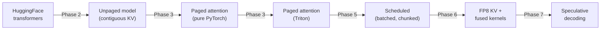
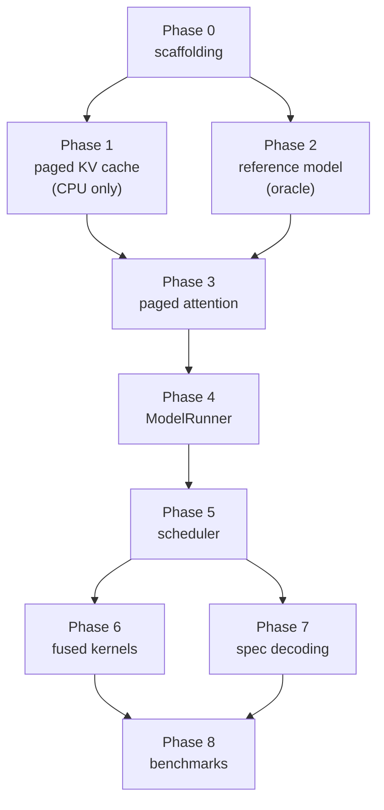

<div align="center">

# Build Plan

**Implementation roadmap for [`DESIGN.md`](./DESIGN.md)**

42 steps · one source file and one test file per step

</div>

---

## Contents

| Phase | Focus | Steps | GPU needed | Design ref |
|---|---|---|---|---|
| [0](#phase-0--scaffolding) | Scaffolding | 0.1–0.2 | no | — |
| [1](#phase-1--paged-kv-cache-cpu-only) | Paged KV cache | 1.1–1.6 | **no** | [§3](./DESIGN.md#3-paged-kv-cache) |
| [2](#phase-2--the-reference-model-your-oracle) | Reference model (the oracle) | 2.1–2.6 | yes | — |
| [3](#phase-3--paged-attention) | Paged attention | 3.1–3.5 | yes | [§3.2](./DESIGN.md#32-block-table-indirection), [§5.1](./DESIGN.md#51-flashattention-paged-ragged) |
| [4](#phase-4--modelrunner) | ModelRunner | 4.1–4.4 | yes | [§2](./DESIGN.md#2-system-architecture) |
| [5](#phase-5--continuous-batching-scheduler) | Scheduler | 5.1–5.7 | yes | [§4](./DESIGN.md#4-continuous-batching-scheduler) |
| [6](#phase-6--fused-kernels) | Fused kernels | 6.1–6.4 | yes | [§5.2](./DESIGN.md#52-fp8-kv-quantization), [§5.3](./DESIGN.md#53-fused-rmsnorm--swiglu) |
| [7](#phase-7--speculative-decoding) | Speculative decoding | 7.1–7.4 | yes | [§6](./DESIGN.md#6-speculative-decoding) |
| [8](#phase-8--validation--benchmarks) | Validation & benchmarks | 8.1–8.4 | yes | [§8](./DESIGN.md#8-testing--validation), [§9](./DESIGN.md#9-performance-targets) |

Supporting material: [How to use this plan](#how-to-use-this-plan) · [The oracle strategy](#the-oracle-strategy) ·
[Environment](#environment--model-choices) · [Repo layout](#repo-layout) · [Test conventions](#test-conventions) ·
[Tolerances](#numerical-tolerances) · [Dependency graph](#dependency-graph)

---

## How to use this plan

Every step is the same loop. Do them in order; each one is small enough to finish in a sitting
and leaves the repo in a green state.

```
1. READ    the DESIGN.md section the step cites — before writing any code
2. PREDICT write down what you expect the test to show (a number, a shape, an ordering)
3. WRITE   the one source file
4. TEST    the one test file, run it, and reconcile it against your prediction
5. COMMIT  only when the step's "Done when" criteria all hold
```

Step 2 is the part people skip and the part that produces the learning. If your prediction and
the test disagree, you have found either a bug or a gap in your mental model, and it is worth
stopping to work out which before moving on.

**Rules that keep the plan honest**

- **One source file per step.** If a step seems to need two, the step is wrong — split it.
- **Never delete a working slower path.** The naive implementations become oracles for the fast
  ones. This is the backbone of the whole plan.
- **The test suite only grows.** A step is not done if it broke an earlier test.
- **Benchmark only after correct.** Every optimization step compares against the correct
  version it replaces, so you always know both the speedup and that it is still right.

---

## The oracle strategy

The central difficulty in an inference engine is that a wrong answer still looks like fluent
text. You cannot eyeball correctness. So the plan is built around **differential testing**:
every fast, clever component is checked against a slow, obvious one that already passed.



Each arrow is a test. The chain means a Phase 7 bug can be bisected by walking backwards until
a layer agrees with its oracle again, which localizes the fault to one hop.

Two consequences worth internalizing:

- **Phase 2 exists only to build the oracle.** It ships no feature from the design doc. Resist
  the urge to skip it — without it, every later phase is untestable.
- **Greedy decoding is your friend.** With `temperature=0` two correct implementations must
  produce *token-identical* output, which is a far sharper signal than comparing float tensors.
  Sampling-based paths get statistical tests instead ([Step 7.2](#step-72--rejection-sampler-the-math)).

---

## Environment & model choices

Detected on this machine:

| Component | Version / spec | Consequence for the plan |
|---|---|---|
| GPU | RTX 5070 Laptop, **8 GB**, Blackwell `sm_120` | 8 GB is the binding constraint — see model table below |
| PyTorch | 2.11.0+cu130 | `torch.float8_e4m3fn` available natively for [§5.2](./DESIGN.md#52-fp8-kv-quantization) |
| Triton | 3.6.0 | Blackwell-capable; kernels in Phases 3 and 6 are Triton, not raw CUDA |
| Python | 3.13.11 | Modern typing syntax is fine (`X | None`, builtin generics) |

**On Triton instead of raw CUDA.** The design says CUDA kernels; Triton compiles to exactly
that, while letting you express the tiling and online-softmax logic in ~100 lines instead of
~1000. You still make every decision that matters — tile sizes, the block-table gather, the
running-max update, warp counts. Once [Step 3.4](#step-34--triton-paged-attention-prefill-ragged--causal) passes, porting a single kernel to raw CUDA
is a well-defined optional exercise with a ready-made correctness test.

**Models.** Both are Qwen2.5, which matters: speculative decoding requires the draft and
target to share a tokenizer and vocabulary.

| Role | Model | FP16 weights | Used from |
|---|---|---|---|
| Dev / iteration | `Qwen2.5-0.5B-Instruct` | ~1.0 GB | Phase 2 onward — fast enough to run every test |
| Target | `Qwen2.5-1.5B-Instruct` | ~3.1 GB | Phase 8 benchmarks, Phase 7 target model |
| Draft | `Qwen2.5-0.5B-Instruct` | ~1.0 GB | Phase 7 draft model |

With the 1.5B target and 0.5B draft resident (~3.8 GB) you have roughly 2.9 GB for the KV cache
— about **75,000 tokens** across both models, which is ample for meaningful batching. Qwen2.5
also uses **GQA** (`num_kv_heads=2` for the 0.5B), so the `num_kv_heads` dimension in the
[§3.1](./DESIGN.md#31-physical-layout) cache layout is exercised for real rather than being a degenerate copy of
`num_heads`.

<details>
<summary><b>Why not Qwen3?</b> (checked and rejected — don't relitigate)</summary>

Weights are not the problem; KV geometry is. Every Qwen3 dense model uses 8 KV heads at
`head_dim=128` regardless of size, so the 0.6B has the same per-token KV cost as the 4B:

| | layers × kv_heads × head_dim | KV per token | Fits in 8 GB |
|---|---|---|---|
| Qwen2.5-0.5B | 24 × 2 × 64 | **12 KiB** | yes, ~503k tokens |
| Qwen2.5-1.5B | 28 × 2 × 128 | **28 KiB** | yes, ~142k tokens |
| Qwen3-0.6B | 28 × 8 × 128 | **112 KiB** | yes, ~49k tokens |
| Qwen3-1.7B | 28 × 8 × 128 | **112 KiB** | yes, ~27k tokens |
| Qwen3-4B | 36 × 8 × 128 | 144 KiB | **no** — 7.5 GB of weights leaves no room |
| Qwen3-8B | 36 × 8 × 128 | 144 KiB | **no** — 15.3 GB |

The Qwen3 0.6B→1.7B speculative pair fits, but leaves only ~7,000 tokens of KV versus ~75,000
for the Qwen2.5 pair — roughly seven concurrent 1k-token sequences. Enough to prove
correctness, too thin for the Phase 8 batch-scaling benchmarks.

Two caveats that apply to **either** family, worth knowing before Phase 7: the draft/target
parameter ratio here is only ~3× (494M vs. 1.54B), far from the 10–100× of classic setups, so
the draft costs about a third of the target per token and realistically caps you below the
[§9](./DESIGN.md#9-performance-targets) target of 1.5–2×. Report the acceptance rate and the
measured speedup separately so the two effects stay legible.

</details>

---

## Repo layout

The end state. Create directories as their first file arrives, not up front.

```text
nanovllm/
├── config.py                  0.2
├── sequence.py                1.3
├── sampler.py                 2.6
├── engine.py                  5.7
├── block/
│   ├── block_pool.py          1.1
│   ├── block_table.py         1.2
│   ├── block_manager.py       1.4, 1.6
│   └── radix_tree.py          1.5
├── model/
│   ├── loader.py              2.1
│   ├── qwen2.py               2.5, 4.2
│   └── layers/
│       ├── rope.py            2.2
│       ├── rmsnorm.py         2.3, 6.1
│       ├── attention_ref.py   2.4
│       └── swiglu.py          6.2
├── kernels/
│   ├── paged_attn_torch.py    3.1
│   ├── store_kv.py            3.2, 6.3
│   ├── flash_decode.py        3.3
│   ├── flash_prefill.py       3.4
│   ├── flash_ragged.py        3.5, 6.4
│   └── fp8.py                 6.3
├── runner/
│   ├── batch.py               4.1
│   ├── runner.py              4.3
│   └── cuda_graph.py          4.4
├── scheduler/
│   ├── policy.py              5.1
│   ├── scheduler.py           5.2, 5.3, 5.4
│   └── preemption.py          5.5, 5.6
└── spec/
    ├── draft_runner.py        7.1
    ├── rejection_sampler.py   7.2
    └── spec_decode.py         7.3, 7.4

tests/            one test_*.py mirroring each source file
benchmarks/       8.1–8.3
```

---

## Test conventions

Established once in [Step 0.1](#step-01--dependencies--pytest-harness) and used by every later step.

| Marker | Meaning | Run with |
|---|---|---|
| *(none)* | Pure CPU logic, milliseconds | `pytest -m "not gpu"` |
| `@pytest.mark.gpu` | Needs CUDA | `pytest -m gpu` |
| `@pytest.mark.oracle` | Needs HF weights downloaded | `pytest -m oracle` |
| `@pytest.mark.slow` | Statistical or stress tests, minutes | `pytest -m slow` |

Conventions that pay off later:

- **Seed everything.** A `seeded` fixture setting `torch.manual_seed` and Python's `random`,
  applied automatically, so a failure is always reproducible.
- **Session-scoped model fixture.** Loading weights per test is unbearable. Load once, reuse.
- **A leak-check fixture** asserting the block pool is fully free at teardown. From
  [Step 1.1](#step-11--block-pool) onward this catches refcount bugs at the moment they are introduced rather
  than three phases later.
- **Property tests over example tests** for the Phase 1 data structures. Random operation
  sequences find the aliasing bugs that hand-written cases miss.

---

## Numerical tolerances

Comparing floats needs a threshold that is tight enough to catch bugs and loose enough to
tolerate legal reassociation. Suggested starting points:

| Comparison | rtol / atol | Note |
|---|---|---|
| Single op, FP32 | `1e-5` | Should be near-exact |
| Single op, FP16 | `1e-3` | Reductions in different orders |
| Full-model logits, FP16 | `2e-2` | Error accumulates across ~24 layers |
| Greedy token IDs | **exact** | The strongest check available — prefer it |
| FP8 KV path | `5e-2` on logits | Plus: greedy tokens must still match for ≥95% of positions |

When a logits comparison fails, compare **layer by layer** rather than staring at the final
tensor. A per-layer hook that diffs against the oracle turns a mystery into an address.

---

## Phase 0 — Scaffolding

Two steps, then you never think about tooling again.

#### Step 0.1 — Dependencies & pytest harness

**Write** `requirements.txt`, `pyproject.toml` (pytest config only) · **Test** `tests/test_env.py`

- Pin `torch`, `triton`, `transformers`, `safetensors`, `pytest`, `numpy`, `scipy` (needed for
  the Phase 7 statistical test), `hypothesis` (property tests in Phase 1).
- Register the four markers from [Test conventions](#test-conventions); add the `seeded` autouse fixture in
  `tests/conftest.py`.

**Done when:** `test_env.py` asserts CUDA is available, compute capability is `(12, 0)`,
`torch.float8_e4m3fn` exists, and Triton imports — and `pytest` collects with no marker warnings.

#### Step 0.2 — Config object

**Write** `nanovllm/config.py` · **Test** `tests/test_config.py`

- A frozen dataclass: `model`, `block_size=16`, `max_seq_len`, `gpu_memory_utilization`,
  `max_num_seqs`, `max_num_batched_tokens`, `dtype`, `kv_cache_dtype`, `enable_prefix_caching`.
- A derived `kv_cache_bytes_per_block(hf_config)` helper:
  `2 · num_layers · block_size · num_kv_heads · head_dim · dtype_size`.
  The 2 is K and V; `num_layers` is there because allocating block *id* 7 reserves slot 7 in
  **every layer's** cache — the cache is per-layer, but a block id is global.
- Validation: `block_size` a power of two, `max_num_batched_tokens >= block_size`.

**Done when:** the calculation is verified by hand for Qwen2.5-0.5B
(`num_layers=24`, `num_kv_heads=2`, `head_dim=64`, FP16):

```text
per layer, per block   2 × 16 × 2 × 64 × 2 B  =   8 KiB
all 24 layers                     × 24        = 192 KiB per block
                                              =  12 KiB per token
```

…and invalid configs raise.

> **Learn:** the per-layer/global split is easy to get wrong and the symptom is nasty — a cache
> sized 24× too small OOMs immediately (obvious), but 24× too large silently under-uses the GPU
> and shows up only as disappointing throughput in Phase 8. Pin it down with a test now, and
> [Step 4.3](#step-43--modelrunner--memory-profiling)'s memory profiling rests on something trustworthy.

---

## Phase 1 — Paged KV cache (CPU only)

**The most valuable phase in the plan.** Everything here is pure Python over integers — no GPU,
no model, no floats. That means millisecond test runs and total debuggability, and it is
exactly where the subtle bugs live (refcount leaks, aliasing across a fork, evicting a block
someone still holds). Build it bulletproof now and the GPU phases become much easier, because
when something breaks later you will already trust this layer.

Design reference: [§3](./DESIGN.md#3-paged-kv-cache).

#### Step 1.1 — Block pool

**Write** `nanovllm/block/block_pool.py` · **Test** `tests/test_block_pool.py`

- `Block(block_id, ref_count)`; pool owns a free list (a `deque` of ids) plus the refcount array.
- API: `allocate() -> block_id`, `incref(id)`, `decref(id)` (returns to free list at zero),
  `num_free`.
- Raise a typed `OutOfBlocks` rather than returning `None` — the scheduler will branch on it.

**Done when:** allocating all blocks then freeing all returns `num_free` to its original value;
double-free raises; a `hypothesis` test over random allocate/incref/decref sequences maintains
the invariant `num_free + len(live_blocks) == total_blocks`.

#### Step 1.2 — Block table

**Write** `nanovllm/block/block_table.py` · **Test** `tests/test_block_table.py`

- Holds the physical block ids for one sequence. `append_block`, `physical_slot(pos)` returning
  `block_id · block_size + pos % block_size`, and `slot_mapping(positions)` producing the flat
  int32 tensor the write kernel will consume in [Step 3.2](#step-32--kv-store-kernel).
- `num_slots` vs. `num_tokens`: capacity is a multiple of `block_size`, occupancy is not.

**Done when:** for a synthetic sequence, `physical_slot(p)` for every `p` matches a naive
Python reference; the last block is correctly partial; `slot_mapping` round-trips through a
`torch.zeros(num_slots).scatter_` into the expected layout.

> **Learn:** this is the [§3.2](./DESIGN.md#32-block-table-indirection) indirection, and it is only integer arithmetic. Convince
> yourself here that non-contiguous physical storage costs nothing but a division and a modulo.

#### Step 1.3 — Sequence state

**Write** `nanovllm/sequence.py` · **Test** `tests/test_sequence.py`

- `Sequence`: `seq_id`, `prompt_token_ids`, `output_token_ids`, `status`, `block_table`,
  `num_cached_tokens` (how much of the prompt came from the prefix cache),
  `num_computed_tokens` (how far chunked prefill has progressed).
- `SequenceStatus`: `WAITING | RUNNING | PREEMPTED | FINISHED`, with a legal-transition table.
- `is_done()`: EOS emitted or `max_tokens` reached.

**Done when:** illegal transitions raise; `num_computed_tokens` advancing past the prompt
correctly flips the sequence from prefill to decode phase.

> **Learn:** the distinction between `num_computed_tokens` and `len(tokens)` *is* chunked
> prefill ([§4.3](./DESIGN.md#43-chunked-prefill)). Modeling it now means Step 5.3 is a scheduler change, not a rewrite.

#### Step 1.4 — Block manager & copy-on-write

**Write** `nanovllm/block/block_manager.py` · **Test** `tests/test_block_manager.py`

- Implement the [§3.5](./DESIGN.md#35-block-manager-api) API: `allocate`, `can_allocate`, `append_slot`, `fork`, `free`.
- `fork` increments refcounts on all of the parent's blocks — no copying.
- `append_slot` implements [§3.3](./DESIGN.md#33-copy-on-write-block-sharing): if the last block is partial *and* has `ref_count > 1`,
  allocate a fresh block, copy, decref the old, repoint the table entry. Return enough
  information (`src_block, dst_block`) for a caller to perform the GPU-side copy later.

**Done when:** the [§8](./DESIGN.md#8-testing--validation) COW test passes — fork a sequence, append to one branch, assert the
other branch's block table is unchanged, assert refcounts return to zero after both are freed.
Also assert that a fork of an N-block sequence allocates **zero** new blocks.

#### Step 1.5 — Radix tree

**Write** `nanovllm/block/radix_tree.py` · **Test** `tests/test_radix_tree.py`

- Nodes keyed by token spans, storing the physical block covering the span, plus
  `last_access_time` for LRU.
- `match_prefix(token_ids) -> (blocks, matched_len)` matching at **block granularity only** —
  a 20-token shared prefix with `block_size=16` yields one block and `matched_len=16`.
- `insert(token_ids, blocks)`, and `evict(num_blocks)` walking LRU leaves, refusing any node
  whose block has `ref_count > 0`, merging childless parents on the way up.

**Done when:** two prompts sharing 40 tokens match exactly 2 blocks; a partially-shared prefix
splits the tree node correctly; eviction never returns a referenced block; evicting everything
restores the pool to fully free.

> **Learn:** the block-granularity rule is not a simplification, it is forced — a block is the
> smallest unit that can be refcounted and shared, so a prefix match that ends mid-block cannot
> be reused without a copy.

#### Step 1.6 — Wire prefix caching into the manager

**Write** `nanovllm/block/block_manager.py` (extend) · **Test** `tests/test_prefix_caching.py`

- `allocate` first calls `match_prefix`, refcounts the hit blocks into the new sequence's table,
  sets `num_cached_tokens`, then allocates only for the remainder.
- On sequence completion, insert its full block list into the tree.
- Under memory pressure, `can_allocate` may trigger `evict`.

**Done when:** issuing the same prompt twice allocates dramatically fewer blocks the second
time and `num_cached_tokens` equals the block-aligned prompt length; a leak check confirms the
pool returns to its initial free count once the tree is cleared.

---

## Phase 2 — The reference model (your oracle)

This phase adds **no feature from the design doc**. Its entire purpose is to produce a
known-correct, slow, unpaged implementation that every later phase is tested against. Skipping
it is the single most likely way to end up with an engine that produces plausible garbage.

#### Step 2.1 — Weight loader

**Write** `nanovllm/model/loader.py` · **Test** `tests/test_loader.py`

- Resolve a HF model id to a local snapshot, read `config.json`, memory-map the safetensors
  shards, and yield `(name, tensor)` pairs.
- A name-mapping table from HF parameter names to yours.

**Done when:** every tensor loaded is bitwise equal to the same tensor from
`transformers.AutoModelForCausalLM`, and no HF parameter is left unmapped (assert the mapping
is total in both directions — an unmapped weight is a silent accuracy bug).

#### Step 2.2 — Rotary embeddings

**Write** `nanovllm/model/layers/rope.py` · **Test** `tests/test_rope.py`

- Precompute `cos`/`sin` tables to `max_seq_len`; apply to Q and K given a **position tensor**,
  not an assumed `arange`.

**Done when:** output matches HF's `apply_rotary_pos_emb` to FP32 tolerance, including for a
non-contiguous position tensor like `[5, 6, 7]`.

> **Learn:** taking explicit positions is what later lets a decode step at position 500 and a
> prefill chunk at positions 0–511 sit in the same batch ([§4.4](./DESIGN.md#44-stall-free-piggyback-decoding)). An implicit `arange` here
> would have to be torn out in Phase 5.

#### Step 2.3 — RMSNorm (PyTorch)

**Write** `nanovllm/model/layers/rmsnorm.py` · **Test** `tests/test_rmsnorm.py`

- The plain version: `x * rsqrt(mean(x²) + eps) * weight`, with the reduction in FP32 even when
  `x` is FP16.

**Done when:** matches HF's `Qwen2RMSNorm` in FP16 and FP32. Keep this file — [Step 6.1](#step-61--fused-rmsnorm-triton) tests
a Triton kernel against it.

#### Step 2.4 — Reference attention (unpaged)

**Write** `nanovllm/model/layers/attention_ref.py` · **Test** `tests/test_attention_ref.py`

- Contiguous-KV attention: materialize the full `[B, H, Q, K]` score matrix, apply the causal
  mask, softmax, multiply by V. Deliberately naive.
- Handle GQA by repeating KV heads to match query heads.

**Done when:** matches `torch.nn.functional.scaled_dot_product_attention` with
`is_causal=True`, for both `num_kv_heads == num_heads` and Qwen's GQA ratio.

> **Learn:** this is the "reference unpaged implementation" that [§8](./DESIGN.md#8-testing--validation) row 1 names. It is the
> oracle for all five steps of Phase 3.

#### Step 2.5 — Full model, unpaged

**Write** `nanovllm/model/qwen2.py` · **Test** `tests/test_model_vs_hf.py`

- Assemble embedding → N × (RMSNorm → attention → residual → RMSNorm → SwiGLU MLP → residual)
  → final norm → LM head, using Steps 2.2–2.4. Batch size 1, no cache, full forward.

**Done when:** logits match HF within the [FP16 full-model tolerance](#numerical-tolerances) on several prompts,
**and** greedy argmax token IDs match exactly for 32 generated tokens.

> If this fails, diff layer by layer with a forward hook. Do not proceed on a near-miss — a 2%
> logits error here becomes divergent text after 50 tokens.

#### Step 2.6 — Sampler

**Write** `nanovllm/sampler.py` · **Test** `tests/test_sampler.py`

- Greedy (`temperature == 0`), temperature scaling, top-k, top-p. Vectorized across the batch —
  every sequence in a batch may have different parameters.

**Done when:** greedy is deterministic; `temperature=1` with a fixed seed reproduces exactly;
a top-p of 0.9 provably never samples outside the 0.9 nucleus; empirical frequencies over
100k draws match the target distribution within Monte-Carlo error.

---

## Phase 3 — Paged attention

Now the design doc's core idea. The key move is [Step 3.1](#step-31--paged-attention-in-pure-pytorch): a paged implementation in
plain PyTorch, which separates *"is my paging logic right"* from *"is my Triton kernel right"*.
Debugging both at once is where this project would otherwise stall.

Design reference: [§5.1](./DESIGN.md#51-flashattention-paged-ragged).

#### Step 3.1 — Paged attention in pure PyTorch

**Write** `nanovllm/kernels/paged_attn_torch.py` · **Test** `tests/test_paged_attn_torch.py`

- Allocate the [§3.1](./DESIGN.md#31-physical-layout) cache tensors. Given a block table, **gather** the K/V for each
  sequence into a contiguous temporary, then call Step 2.4's reference attention.
- Slow and memory-hungry on purpose. Correct by construction.

**Done when:** for identical logical content, paged output equals unpaged output to FP32
tolerance — including when the block table is **deliberately shuffled** so physical order does
not match logical order. That shuffle is the real test of the indirection.

#### Step 3.2 — KV store kernel

**Write** `nanovllm/kernels/store_kv.py` · **Test** `tests/test_store_kv.py`

- A Triton kernel writing new K/V into the paged cache at positions given by the `slot_mapping`
  from [Step 1.2](#step-12--block-table). One program per token, vectorized over `head_dim`.

**Done when:** matches an equivalent `cache.view(-1, ...)[slots] = kv` PyTorch scatter, for
ragged batches where different sequences contribute different token counts.

> **Learn:** your first Triton kernel, and an easy one — pure data movement, no reductions.
> Get comfortable with `tl.program_id`, `tl.load`/`tl.store`, and masking here.

#### Step 3.3 — Triton paged attention, decode

**Write** `nanovllm/kernels/flash_decode.py` · **Test** `tests/test_flash_decode.py`

- Query length 1. One program per `(sequence, kv_head)`. Loop over the sequence's blocks via the
  block table, accumulating with the **online softmax** from [§5.1](./DESIGN.md#51-flashattention-paged-ragged) — running `m_i`, `l_i`,
  and accumulator `O_i`, rescaling on every tile.

**Done when:** matches Step 3.1 to FP16 tolerance across context lengths that are exact
multiples of `block_size` and lengths that leave a partial final block (the masking case that
breaks naive implementations).

> **Learn:** write out the online-softmax rescaling by hand for two tiles before you code it.
> Understanding why `O_i` must be rescaled by `exp(m_old - m_new)` — and not just `l_i` — is the
> single most important idea in the kernel.

#### Step 3.4 — Triton paged attention, prefill (ragged + causal)

**Write** `nanovllm/kernels/flash_prefill.py` · **Test** `tests/test_flash_prefill.py`

- Query length > 1, so you now tile over queries as well as keys, and need the causal mask
  *within* the diagonal tile. Grid: one program per `(sequence, head, query-tile)` per [§5.1](./DESIGN.md#51-flashattention-paged-ragged).
- Skip key tiles entirely above the diagonal — a real speedup, and a source of off-by-one bugs.

**Done when:** matches Step 3.1 for prompt lengths that are and are not multiples of the tile
size, and for a batch whose sequences have different lengths (via `cu_seqlens`).

#### Step 3.5 — Unified ragged kernel

**Write** `nanovllm/kernels/flash_ragged.py` · **Test** `tests/test_flash_ragged.py`

- Merge 3.3 and 3.4 into one kernel where query length varies **per sequence within one batch** —
  1 for decode, up to the chunk size for prefill. Per-CTA loop bounds read from `seq_lens` and
  `context_lens`; no host-side branching.

**Done when:** a mixed batch of `[prefill(300), decode(1), decode(1), prefill(50)]` produces,
for every sequence, exactly what that sequence produces when run alone.

> This is the hard prerequisite for [§4.4](./DESIGN.md#44-stall-free-piggyback-decoding) piggybacking. Phase 5 cannot start without it.

---

## Phase 4 — ModelRunner

Connect the cache to the model and make a single forward pass over a real batch work.

#### Step 4.1 — Forward batch metadata

**Write** `nanovllm/runner/batch.py` · **Test** `tests/test_batch.py`

- A `ForwardBatch` dataclass holding exactly what the kernels need: flattened `input_ids`,
  `positions`, `cu_seqlens_q`, `seq_lens`, `context_lens`, `block_tables` (padded 2-D int32),
  `slot_mapping`, plus the per-sequence sampling parameters.
- A builder taking a list of scheduled sequences and producing it in one pass.

**Done when:** invariants hold — `cu_seqlens_q[-1] == len(input_ids)`, every `slot_mapping`
entry is within the pool, `context_lens >= seq_lens`, block table rows are padded with a
sentinel that the kernel never reads.

> **Learn:** this object is the entire contract between scheduler and GPU. Making it a
> validated dataclass rather than a bag of tensors is what keeps Phase 5 debuggable.

#### Step 4.2 — Swap paged attention into the model

**Write** `nanovllm/model/qwen2.py` (extend) · **Test** `tests/test_model_paged.py`

- Attention layers now take a `ForwardBatch` and call Step 3.5, writing new KV via Step 3.2.
- Keep the Step 2.4 path selectable by a flag — you will want it again when something breaks.

**Done when:** greedy generation of 64 tokens through the paged path is **token-identical** to
Phase 2's unpaged path, for single sequences and for a batch of three different prompts.

#### Step 4.3 — ModelRunner & memory profiling

**Write** `nanovllm/runner/runner.py` · **Test** `tests/test_runner.py`

- Owns the model and the KV cache. At startup: run a dummy max-size forward, measure peak
  activation memory, then size `num_blocks` from
  `(total · gpu_memory_utilization − weights − peak_activations) / bytes_per_block`.

**Done when:** the computed `num_blocks` allocates without OOM at
`gpu_memory_utilization=0.9`, and a max-size batch immediately afterward also fits. Log the
derived number — on 8 GB with the 0.5B model you should see thousands of blocks.

#### Step 4.4 — CUDA graph capture for decode

**Write** `nanovllm/runner/cuda_graph.py` · **Test** `tests/test_cuda_graph.py`

- Capture the decode-only path at several fixed batch sizes (say 1, 2, 4, 8, 16, 32), padding up
  to the nearest captured size. Static input buffers copied into on each call.
- Prefill stays eager — shapes vary too much.

**Done when:** graph-replayed logits equal eager logits exactly (same kernels, same order), and
a benchmark shows a measurable per-step latency drop at small batch sizes.

> **Learn:** at batch size 1 a decode step is launch-bound, not compute-bound — dozens of tiny
> kernels each costing microseconds of launch overhead. This step is where you *see* that.

---

## Phase 5 — Continuous batching scheduler

Design reference: [§4](./DESIGN.md#4-continuous-batching-scheduler). Every step here is testable by asserting that a scheduling
decision never changes the *output*, only the *timing*. That invariant is what makes the phase
tractable.

#### Step 5.1 — Queues & policy

**Write** `nanovllm/scheduler/policy.py` · **Test** `tests/test_policy.py`

- Waiting and running queues; FCFS ordering with a priority hook; preempted sequences re-enter
  at the **front** per [§4.2](./DESIGN.md#42-iteration-level-preemption).

**Done when:** ordering is verified including the preemption re-entry case, and a starvation
test shows a long-waiting sequence eventually runs under continuous new arrivals.

#### Step 5.2 — The scheduling loop

**Write** `nanovllm/scheduler/scheduler.py` · **Test** `tests/test_scheduler.py`

- Implement [§4.1](./DESIGN.md#41-iteration-level-scheduling): each iteration, admit what fits, build a batch, and after the
  forward pass free finished sequences and extend the rest.
- Admission is gated by `can_allocate` per [§4.5](./DESIGN.md#45-admission-control) — admit only if one more decode step is
  guaranteed to have blocks.

**Done when:** a finished sequence is replaced within the same iteration (assert batch
composition changes at the boundary, not after a drain); and an adversarial test that admits
until the pool is nearly exhausted **never** OOMs mid-iteration.

#### Step 5.3 — Chunked prefill

**Write** `nanovllm/scheduler/scheduler.py` (extend) · **Test** `tests/test_chunked_prefill.py`

- Split prompts longer than the chunk size, advancing `num_computed_tokens` per iteration
  ([§4.3](./DESIGN.md#43-chunked-prefill)).

**Done when:** a 2000-token prompt processed in 512-token chunks yields **identical** logits to
the same prompt processed in one pass. This is the test that catches position or mask errors at
chunk boundaries.

#### Step 5.4 — Piggyback mixed batches

**Write** `nanovllm/scheduler/scheduler.py` (extend) · **Test** `tests/test_piggyback.py`

- Fill leftover token budget after a prefill chunk with pending decode steps ([§4.4](./DESIGN.md#44-stall-free-piggyback-decoding)).

**Done when:** every sequence's output in a mixed batch is identical to running it alone, and
an assertion confirms the iteration count for a mixed workload is lower than with
prefill-prioritized scheduling.

#### Step 5.5 — Preemption by recompute

**Write** `nanovllm/scheduler/preemption.py` · **Test** `tests/test_preempt_recompute.py`

- Drop a victim's blocks; on resume, re-prefill from prompt + already-generated tokens ([§4.2](./DESIGN.md#42-iteration-level-preemption)).

**Done when:** with the pool shrunk to force preemption, generated text is **token-identical**
to the unpreempted run, and the pool shows no leaked blocks afterward.

> **Learn:** the reason recompute is even viable is that prefill is parallel while decode is
> sequential — re-running 200 tokens of prefill can genuinely beat a PCIe round trip.

#### Step 5.6 — Preemption by swap

**Write** `nanovllm/scheduler/preemption.py` (extend) · **Test** `tests/test_preempt_swap.py`

- Copy victim blocks to pinned CPU memory, free the GPU blocks, copy back on resume. Add the
  cost model that picks swap vs. recompute from sequence length and measured bandwidth.

**Done when:** a swap-out/swap-in round trip is **bitwise** identical; output matches the
unpreempted run; and the cost model's choice flips as sequence length grows, at a crossover you
have measured rather than guessed.

#### Step 5.7 — Engine API

**Write** `nanovllm/engine.py` · **Test** `tests/test_engine.py`

- The public surface: `LLM(model, **config)` and `generate(prompts, sampling_params)`, plus a
  streaming generator variant. Tokenizer in, detokenized text out.

**Done when:** greedy output for a batch of 16 varied-length prompts matches
`transformers.generate` token for token. **This is the milestone — the engine now works
end to end.** Everything after is optimization.

---

## Phase 6 — Fused kernels

With a correct engine, optimization becomes safe: every step here has a passing test to answer
"is it still right" and a benchmark to answer "is it faster". Run both, every time.

#### Step 6.1 — Fused RMSNorm (Triton)

**Write** `nanovllm/model/layers/rmsnorm.py` (extend) · **Test** `tests/test_rmsnorm_fused.py`

- One kernel doing reduction, normalize, and scale, per [§5.3](./DESIGN.md#53-fused-rmsnorm--swiglu). One program per row, FP32
  accumulation, vectorized loads.
- Add the residual-add fusion variant (`x + residual` then norm) — that pattern appears twice
  per layer.

**Done when:** matches Step 2.3 to FP16 tolerance, and a benchmark reports the bandwidth
achieved versus the theoretical peak. Since the op is memory-bound, that ratio is the real score.

#### Step 6.2 — Fused SwiGLU (Triton)

**Write** `nanovllm/model/layers/swiglu.py` · **Test** `tests/test_swiglu.py`

- Fuse `SiLU(gate) * up` into one kernel after the two GEMMs ([§5.3](./DESIGN.md#53-fused-rmsnorm--swiglu)), avoiding a separate
  elementwise pass over the intermediate.

**Done when:** matches a PyTorch `F.silu(gate) * up` reference, end-to-end model output is
unchanged, and the benchmark shows the saved round trip to global memory.

#### Step 6.3 — FP8 quantization utilities

**Write** `nanovllm/kernels/fp8.py`, extend `store_kv.py` · **Test** `tests/test_fp8.py`

- Per-block scale computed at write time; store as `torch.float8_e4m3fn` ([§5.2](./DESIGN.md#52-fp8-kv-quantization)).
- Scale = `max_abs / FP8_MAX`, in FP32, with a floor to avoid a zero scale.

**Done when:** quantize→dequantize round-trip relative error is within E4M3's ~2⁻³ mantissa
resolution; the cache tensor's `nbytes` is exactly half the FP16 equivalent; edge cases (all
zeros, one huge outlier) do not produce NaN or Inf.

#### Step 6.4 — FP8 dequant fused into attention

**Write** `nanovllm/kernels/flash_ragged.py` (extend) · **Test** `tests/test_fp8_attention.py`

- Dequantize inside the tile load — load byte, convert, multiply by scale, before QKᵀ ([§5.2](./DESIGN.md#52-fp8-kv-quantization)).
  No separate dequant pass, no FP16 copy of the cache.

**Done when:** logits are within the [FP8 tolerance](#numerical-tolerances) of the FP16 path; greedy tokens agree for
≥95% of positions over a long generation; and — the payoff — `num_blocks` computed by
[Step 4.3](#step-43--modelrunner--memory-profiling) roughly doubles at the same `gpu_memory_utilization`. Assert that doubling.

---

## Phase 7 — Speculative decoding

Design reference: [§6](./DESIGN.md#6-speculative-decoding). The intellectually richest phase: a technique that makes
generation faster while provably not changing the distribution it samples from.

#### Step 7.1 — Draft runner

**Write** `nanovllm/spec/draft_runner.py` · **Test** `tests/test_draft_runner.py`

- Second `ModelRunner` with the 0.5B model and its **own** block pool. Propose `k` tokens
  autoregressively, returning tokens and their probabilities `q`.
- Assert at construction that draft and target vocabularies are identical.

**Done when:** `k` tokens and a `[k, vocab]` probability tensor come back; the draft's own KV
state is correct (its `k`-th token matches what a fresh forward on the same prefix produces);
memory for both models stays inside 8 GB.

#### Step 7.2 — Rejection sampler (the math)

**Write** `nanovllm/spec/rejection_sampler.py` · **Test** `tests/test_rejection_sampler.py`

- A pure function: given draft probs `q`, target probs `p`, and proposed tokens, apply [§6.2](./DESIGN.md#62-rejection-sampling-distribution-preserving) —
  accept with probability `min(1, p/q)`; on rejection sample from `normalize(max(0, p - q))` and
  discard the remaining proposals; if all `k` accept, sample a bonus token from `p`.
- No model, no GPU state — just tensors in, tokens out.

**Done when** *(the marquee test of the project)*: over ≥100k trials with small synthetic
vocabularies, the distribution of accepted tokens is statistically indistinguishable from
direct sampling from `p` — chi-square p-value > 0.01. Verify it holds for a **deliberately
terrible** draft distribution (e.g. uniform, or adversarially anti-correlated with `p`), which
should hurt the acceptance *rate* while leaving the output distribution exact.

> **Learn:** run that test with a bad draft and watch correctness hold while throughput
> collapses. That is [§6.2](./DESIGN.md#62-rejection-sampling-distribution-preserving)'s guarantee made tangible: draft quality is a performance
> parameter, never a correctness one.

#### Step 7.3 — Integration & rollback

**Write** `nanovllm/spec/spec_decode.py` · **Test** `tests/test_spec_decode.py`

- Allocate KV for all `k` speculative tokens, run one target forward over the proposals, apply
  Step 7.2, then **roll back** the block table to the accepted length — metadata only, no data
  movement ([§6.3](./DESIGN.md#63-scheduler-integration)).

**Done when:** blocks are correctly returned after a rejection at every position from 0 to `k`
(the leak-check fixture is doing real work here); with `temperature=0`, output is
token-identical to non-speculative greedy decoding; and the measured acceptance rate for
0.5B-drafting-1.5B lands in a plausible 0.5–0.8 band.

#### Step 7.4 — Adaptive speculation length

**Write** `nanovllm/spec/spec_decode.py` (extend) · **Test** `tests/test_adaptive_k.py`

- Track a rolling acceptance rate and adjust `k` — raise it while acceptance is high, shrink it
  when acceptance falls so you stop paying for verification of tokens that get thrown away.

**Done when:** on a synthetic workload with a deliberately shifting acceptance rate, `k` tracks
it in the expected direction, stays within bounds, and total wall-clock beats every fixed `k`
you compare against.

---

## Phase 8 — Validation & benchmarks

Turn the [§9](./DESIGN.md#9-performance-targets) targets into numbers you can actually cite.

#### Step 8.1 — Throughput benchmark

**Write** `benchmarks/bench_throughput.py` · **Test** `tests/test_bench_smoke.py`

- Fixed prompt set, measure output tokens/sec against `transformers.generate` as baseline.
  Report batch-size scaling. Include a warmup; exclude model load time.

**Done when:** the harness runs both engines on identical inputs and prints a comparison table.
Expect a large win over HF at batch sizes above 1 — that gap is continuous batching plus paging.

#### Step 8.2 — Scheduler stress test

**Write** `benchmarks/bench_scheduler.py` · **Test** `tests/test_stress.py`

- The [§8](./DESIGN.md#8-testing--validation) adversarial mix: many short sequences alongside a few very long ones, arriving on a
  Poisson schedule. Compare chunked prefill against a prefill-prioritized baseline.

**Done when:** P99 decode latency is measurably lower with chunked prefill, quantifying the
head-of-line claim in [§4.3](./DESIGN.md#43-chunked-prefill); and a multi-thousand-request run finishes with zero leaked
blocks and no OOM.

#### Step 8.3 — Latency harness

**Write** `benchmarks/bench_latency.py` · **Test** *(covered by 8.1's smoke test)*

- TTFT and inter-token latency distributions (P50/P90/P99), swept over batch size, with and
  without CUDA graphs, with and without speculative decoding.

**Done when:** you can fill in every row of the [§9](./DESIGN.md#9-performance-targets) table with a measured number, including
whether spec decoding hits the 1.5–2× target at your observed acceptance rate.

#### Step 8.4 — README with results

**Write** `README.md` · **Test** *(none — prose)*

- Currently empty. Write it last, when you have real numbers: what it is, architecture summary
  with a link to `DESIGN.md`, benchmark table, what you learned, what the known limitations are.

**Done when:** someone can clone, install, and reproduce your headline benchmark from the
README alone.

---

## Dependency graph

Where the plan is strictly ordered and where it is not.



**Phases 1 and 2 are independent** — Phase 1 needs no GPU at all, so it is the natural thing to
work on away from the machine, or while a model download runs.

**Phases 6 and 7 are independent of each other.** Both need a working engine from Phase 5;
neither needs the other. If you want the payoff sooner, do Phase 7 first — speculative decoding
is the more interesting result, and the FP8 work in Phase 6 is the fiddlier debugging.

**The one milestone that matters is [Step 5.7](#step-57--engine-api).** Before it you have components; after it
you have an engine, and every remaining step is a measurable improvement to something that
already works.
